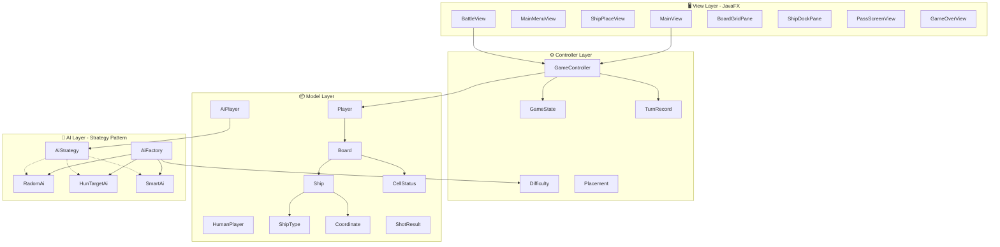
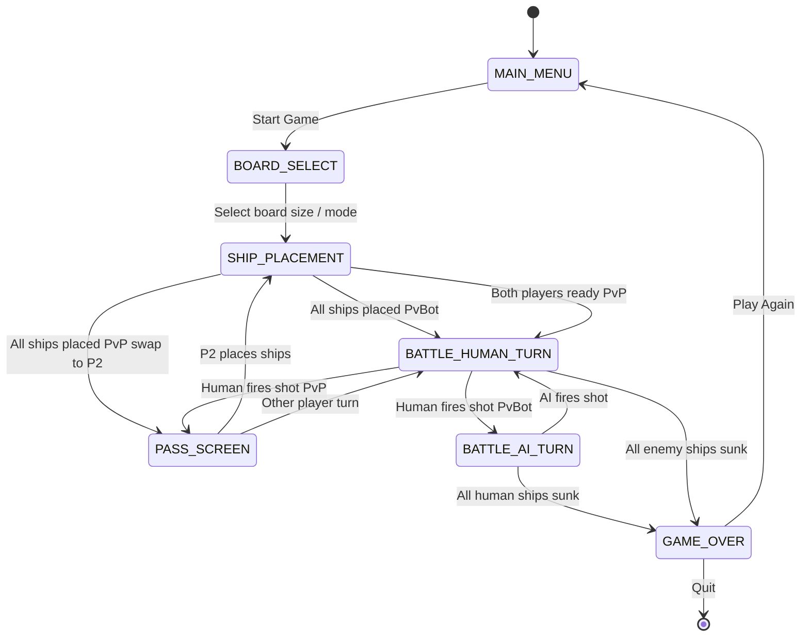
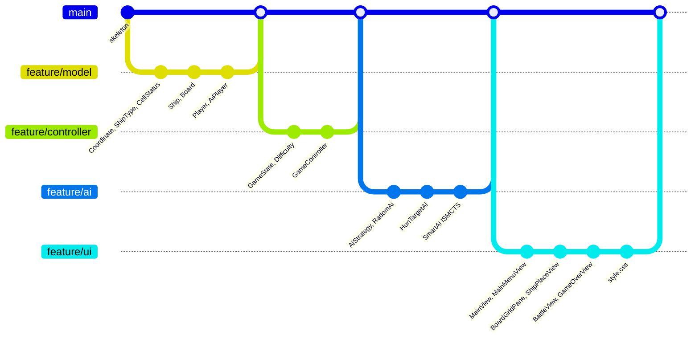
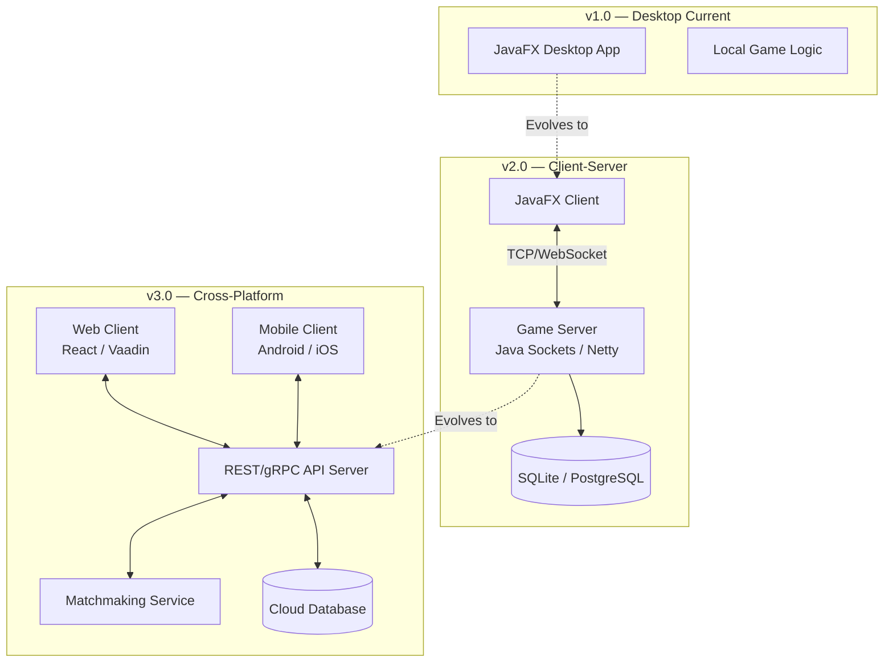

# 🚢 BattleShip-Game — Comprehensive Project Analysis

> **Project**: BattleShip-Game  
> **Tech Stack**: Java 17 · JavaFX 21 · Maven · Gson  
> **Repo**: [github.com/seavminhleang-art/BattleShip-Game](https://github.com/seavminhleang-art/BattleShip-Game)  
> **Team Branches**: `main`, `senghak`, `seavminh`  
> **Analysis Date**: August 7, 2026  

---

## Table of Contents

1. [Current State Assessment](#1-current-state-assessment)
2. [Architecture Overview](#2-architecture-overview)
3. [What You Need to Know](#3-what-you-need-to-know)
4. [What You Need to Do — Implementation Roadmap](#4-what-you-need-to-do--implementation-roadmap)
5. [Detailed Implementation Guide Per Layer](#5-detailed-implementation-guide-per-layer)
6. [AI Strategy Deep Dive](#6-ai-strategy-deep-dive)
7. [Testing Strategy](#7-testing-strategy)
8. [Team Workflow & Git Strategy](#8-team-workflow--git-strategy)
9. [Future Scaling](#9-future-scaling)
10. [Risk Assessment & Mitigation](#10-risk-assessment--mitigation)

---

## 1. Current State Assessment

### 1.1 Project Health Dashboard

| Metric | Status | Detail |
|---|:---:|---|
| **Java Source Files** | 🔴 Empty | 28 files, all empty class skeletons (4 lines each, 112 lines total) |
| **FXML Views** | 🔴 Empty | 6 FXML files (5 are 0 bytes, 1 has only XML header) |
| **CSS Styling** | 🔴 Empty | `style.css` is 0 bytes |
| **Maven Build** | 🟢 Configured | `pom.xml` is complete with JavaFX 21, Gson, shade plugin |
| **Git Repo** | 🟡 Minimal | 4 commits, 3 remote branches, no meaningful diffs |
| **`.gitignore`** | 🟢 Complete | Properly configured for Maven, IntelliJ, Eclipse, VS Code |
| **Architecture Design** | 🟢 Well-Planned | MVC + Strategy pattern, clear package separation |

### 1.2 What Exists vs What Doesn't

```
✅ EXISTS                              ❌ MISSING
─────────────────────────             ─────────────────────────
Maven project config (pom.xml)        Any Java logic/implementation
Package & class skeleton structure    FXML UI layouts
.gitignore                            CSS styling
Git repo with team branches           Unit tests (no test/ directory)
Dependency declarations (JavaFX,      Game loop & state machine
  Gson)                               AI algorithms
                                      Sound/image assets
                                      README documentation
                                      CI/CD pipeline
```

### 1.3 File Inventory (36 total project files)

```
src/main/java/Com/BattleShip/
├── Main.java                              ← App entry point (empty)
├── Ai/
│   ├── AiStrategy.java                    ← Strategy interface (empty)
│   ├── AiFactory.java                     ← Factory for difficulty (empty)
│   ├── RadomAi.java                       ← Easy AI (empty)
│   ├── HunTargetAi.java                   ← Medium AI (empty)
│   └── SmartAi.java                       ← Hard AI (empty)
├── Model/
│   ├── Board.java                         ← 10×10 grid (empty)
│   ├── Player.java                        ← Base player (empty)
│   ├── AiPlayer.java                      ← Computer player (empty)
│   ├── HumanPlayer.java                   ← Human player (empty)
│   ├── Ship.java                          ← Ship entity (empty)
│   ├── ShipType.java                      ← Ship definitions (empty)
│   ├── CellStatus.java                    ← Cell states enum (empty)
│   ├── Coordinate.java                    ← Grid position (empty)
│   └── ShotResult.java                    ← Shot outcome (empty)
├── Controller/
│   ├── GameController.java                ← Main game orchestrator (empty)
│   ├── GameState.java                     ← Game lifecycle phases (empty)
│   ├── Difficulty.java                    ← Difficulty levels (empty)
│   ├── TurnRecord.java                    ← Turn history (empty)
│   └── Placement.java                     ← Ship placement data (empty)
└── View/
    ├── MainView.java                      ← Root scene manager (empty)
    ├── MainMenuView.java                  ← Title screen (empty)
    ├── ShipPlaceView.java                 ← Ship placement screen (empty)
    ├── BattleView.java                    ← Main battle screen (empty)
    ├── BoardGridPane.java                 ← Reusable grid component (empty)
    ├── ShipDockPane.java                  ← Ship inventory panel (empty)
    ├── PassScreenView.java                ← PvP turn handoff (empty)
    └── GameOverView.java                  ← Win/loss screen (empty)

src/main/resources/
├── CSS/style.css                          ← (empty)
└── fxml/
    ├── main-menu.fxml                     ← (empty)
    ├── ship-place.fxml                    ← (empty)
    ├── battle.fxml                        ← (empty)
    ├── board-select.fxml                  ← (XML header only)
    ├── pass-screen.fxml                   ← (empty)
    └── game-over.fxml                     ← (empty)
```

---

## 2. Architecture Overview

### 2.1 Design Pattern: MVC + Strategy



### 2.2 Game Flow State Machine



### 2.3 Key Design Decisions Already Made

| Decision | Choice | Implication |
|---|---|---|
| **Language** | Java 17 | Modern records, sealed classes, pattern matching available |
| **UI Framework** | JavaFX 21 + FXML | Declarative UI with CSS styling, Scene Builder compatible |
| **Serialization** | Gson | Save/load game state as JSON |
| **Build** | Maven + Shade plugin | Produces a single fat JAR for distribution |
| **AI Architecture** | Strategy + Factory patterns | Clean swap between difficulty levels at runtime |

---

## 3. What You Need to Know

### 3.1 Standard Battleship Game Rules

| Rule | Standard Value |
|---|---|
| **Grid Size** | 10 x 10 (labeled A-J rows, 1-10 columns) |
| **Ships** | Carrier (5), Battleship (4), Cruiser (3), Submarine (3), Destroyer (2) |
| **Total ship cells** | 17 out of 100 (17% coverage) |
| **Turns** | Alternating — one shot per turn |
| **Shot Results** | MISS, HIT, SUNK (+ which ship) |
| **Win Condition** | First player to sink all 5 enemy ships |

### 3.2 Game Modes You Will Need

| Mode | Description | AI Required? |
|---|---|:---:|
| **Player vs Bot** | Human vs computer with selectable difficulty | ✅ |
| **Player vs Player (Local)** | Two humans on same machine, pass-and-play | ❌ |
| **Player vs Player (Online)** | Future stretch goal — networked multiplayer | ❌ (future) |

### 3.3 Critical Technical Concepts

#### Imperfect Information
Battleship is an **imperfect information** game — each player has a hidden board the opponent cannot see. This is why:
- **Minimax does not work** — it requires perfect information (like Chess)
- **MCTS (ISMCTS) is ideal** — it handles hidden information natively via determinization (sampling)

#### Two Boards Per Player
Each player conceptually interacts with two grids:
1. **Own Board** (`Board`) — shows where your ships are + where enemy has shot
2. **Tracking Board** — shows where you have shot at the enemy (hits/misses only)

#### The Strategy Pattern for AI
```
AiStrategy (interface)
    ├── RadomAi      → picks random un-shot cells
    ├── HunTargetAi  → random until hit, then targets adjacent cells
    └── SmartAi      → ISMCTS with probability heatmap
```
`AiFactory` creates the right strategy based on `Difficulty`.

---

## 4. What You Need to Do — Implementation Roadmap

### Phase 1: Core Model (Week 1) — Foundation

> [!IMPORTANT]
> Priority: CRITICAL — Everything else depends on this

| # | Task | Files | Est. Effort |
|---|---|---|---|
| 1.1 | Implement `Coordinate` as a Java `record` | Coordinate.java | 30 min |
| 1.2 | Implement `ShipType` as an `enum` with sizes | ShipType.java | 30 min |
| 1.3 | Implement `CellStatus` as an `enum` | CellStatus.java | 20 min |
| 1.4 | Implement `ShotResult` as a `record` | ShotResult.java | 30 min |
| 1.5 | Implement `Ship` (positions, hit tracking, sunk check) | Ship.java | 1-2 hrs |
| 1.6 | Implement `Board` (grid, placement, shot resolution) | Board.java | 3-4 hrs |
| 1.7 | Implement `Player` base class | Player.java | 1 hr |
| 1.8 | Implement `HumanPlayer` and `AiPlayer` | HumanPlayer.java, AiPlayer.java | 1 hr |
| 1.9 | Implement `Placement` record | Placement.java | 30 min |

**Dependency order:**
```
Coordinate → ShipType → CellStatus → ShotResult → Ship → Board → Player → HumanPlayer/AiPlayer
```

### Phase 2: Game Controller (Week 2) — Logic

> [!IMPORTANT]
> Priority: CRITICAL

| # | Task | Files | Est. Effort |
|---|---|---|---|
| 2.1 | Implement `GameState` enum | GameState.java | 20 min |
| 2.2 | Implement `Difficulty` enum | Difficulty.java | 20 min |
| 2.3 | Implement `TurnRecord` | TurnRecord.java | 30 min |
| 2.4 | Implement `GameController` (game loop, turn management, win check) | GameController.java | 4-6 hrs |

### Phase 3: Basic AI (Week 2-3) — Playable Bot

| # | Task | Files | Est. Effort |
|---|---|---|---|
| 3.1 | Define `AiStrategy` as an interface | AiStrategy.java | 20 min |
| 3.2 | Implement `RadomAi` | RadomAi.java | 1 hr |
| 3.3 | Implement `HunTargetAi` | HunTargetAi.java | 2-3 hrs |
| 3.4 | Implement `AiFactory` | AiFactory.java | 30 min |
| 3.5 | Implement `SmartAi` (ISMCTS) | SmartAi.java | 4-6 hrs |

### Phase 4: UI Views (Week 3-4) — Visual Layer

| # | Task | Files | Est. Effort |
|---|---|---|---|
| 4.1 | Implement `Main` (JavaFX Application launch) | Main.java | 1 hr |
| 4.2 | Implement `MainView` (scene management, navigation) | MainView.java | 2 hrs |
| 4.3 | Build `main-menu.fxml` + `MainMenuView` | FXML + Java | 2-3 hrs |
| 4.4 | Build `BoardGridPane` (reusable 10x10 grid component) | BoardGridPane.java | 3-4 hrs |
| 4.5 | Build `ShipDockPane` (draggable ship inventory) | ShipDockPane.java | 2-3 hrs |
| 4.6 | Build `ship-place.fxml` + `ShipPlaceView` | FXML + Java | 3-4 hrs |
| 4.7 | Build `battle.fxml` + `BattleView` | FXML + Java | 4-6 hrs |
| 4.8 | Build `pass-screen.fxml` + `PassScreenView` | FXML + Java | 1-2 hrs |
| 4.9 | Build `game-over.fxml` + `GameOverView` | FXML + Java | 2 hrs |
| 4.10 | Implement `style.css` (theme, colors, animations) | style.css | 3-4 hrs |

### Phase 5: Polish & Integration (Week 4-5)

| # | Task | Est. Effort |
|---|---|---|
| 5.1 | Save/Load game state with Gson | 2-3 hrs |
| 5.2 | Sound effects (hits, misses, sinking, victory) | 2-3 hrs |
| 5.3 | Animations (shot impact, ship sinking, screen transitions) | 3-4 hrs |
| 5.4 | Board size selection (board-select.fxml) | 1-2 hrs |
| 5.5 | Player vs Player (local pass-and-play) mode | 2-3 hrs |
| 5.6 | Unit tests for Model and AI | 4-6 hrs |
| 5.7 | Build fat JAR distribution | 1 hr |

---

## 5. Detailed Implementation Guide Per Layer

### 5.1 Model Layer — Recommended Implementations

#### `Coordinate.java` — Use Java Record
```java
public record Coordinate(int row, int col) {
    public Coordinate {
        if (row < 0 || col < 0)
            throw new IllegalArgumentException("Negative coordinates");
    }
    public boolean isWithinBounds(int gridSize) {
        return row >= 0 && row < gridSize && col >= 0 && col < gridSize;
    }
}
```

#### `ShipType.java` — Use Enum
```java
public enum ShipType {
    CARRIER("Carrier", 5),
    BATTLESHIP("Battleship", 4),
    CRUISER("Cruiser", 3),
    SUBMARINE("Submarine", 3),
    DESTROYER("Destroyer", 2);

    private final String name;
    private final int size;
    // constructor + getters
}
```

#### `CellStatus.java` — Use Enum
```java
public enum CellStatus {
    EMPTY,      // Water, no ship, not yet shot
    SHIP,       // Ship present (own board only — never revealed to opponent)
    HIT,        // Shot landed on a ship
    MISS,       // Shot landed on water
    SUNK        // Part of a fully sunk ship (optional visual distinction)
}
```

#### `Board.java` — Core Data Structure
```java
public class Board {
    public static final int DEFAULT_SIZE = 10;
    private final int size;
    private final CellStatus[][] grid;
    private final List<Ship> ships;

    // Key methods:
    // boolean placeShip(Ship ship, Coordinate start, boolean horizontal)
    // ShotResult receiveShot(Coordinate target)
    // boolean allShipsSunk()
    // CellStatus getCellStatus(Coordinate coord)
    // List<Coordinate> getUnshotCells()
}
```

### 5.2 Controller Layer — Game State Machine

```java
public enum GameState {
    MAIN_MENU,
    BOARD_SELECT,
    SHIP_PLACEMENT_P1,
    SHIP_PLACEMENT_P2,
    PASS_SCREEN,
    BATTLE_HUMAN_TURN,
    BATTLE_AI_TURN,
    GAME_OVER
}
```

`GameController` must handle:
- State transitions between `GameState` values
- Shot processing: receive coordinate → resolve on board → update tracking → check win
- Turn alternation: Human → AI (PvBot) or Human → PassScreen → Human (PvP)
- Ship placement validation during setup
- Game history via `TurnRecord` list

### 5.3 View Layer — JavaFX Component Hierarchy

```
MainView (root StackPane — manages scene switching)
├── MainMenuView
│   ├── Title / Logo
│   ├── "Player vs Bot" button
│   ├── "Player vs Player" button
│   └── Settings / Difficulty selector
├── ShipPlaceView
│   ├── BoardGridPane (own board, 10×10)
│   ├── ShipDockPane (ship inventory, drag-and-drop)
│   ├── Rotate button
│   └── Confirm / Ready button
├── BattleView
│   ├── BoardGridPane (enemy tracking board — clickable)
│   ├── BoardGridPane (own board — read-only)
│   ├── Status label ("Your Turn" / "Enemy Turn")
│   └── Ship status panel (remaining ships)
├── PassScreenView
│   └── "Pass device to [Player Name]" + Continue button
└── GameOverView
    ├── Winner announcement
    ├── Stats (shots fired, accuracy, turns)
    └── "Play Again" / "Main Menu" buttons
```

---

## 6. AI Strategy Deep Dive

### 6.1 Difficulty Tiers

| Difficulty | Strategy | Algorithm | Avg Shots to Win | Complexity |
|---|---|---|---|---|
| **Easy** | `RadomAi` | Pure random (un-shot cells) | ~95 shots | Trivial |
| **Medium** | `HunTargetAi` | Hunt → Target on hit | ~55-65 shots | Moderate |
| **Hard** | `SmartAi` | ISMCTS + Probability Heatmap | ~42-48 shots | Advanced |

### 6.2 Why ISMCTS Over Minimax

| Factor | Minimax | MCTS / ISMCTS |
|---|:---:|:---:|
| Hidden information | ❌ Fundamentally broken | ✅ Native determinization |
| State space explosion | ❌ ~3B permutations/node | ✅ Bounded by rollout count |
| Response time | ❌ Seconds to minutes | ✅ 50-200ms configurable |
| Difficulty tuning | ❌ Hard | ✅ Change rollout budget |
| Implementation fit | ❌ Needs Expectiminimax | ✅ Drops into Strategy pattern |

> [!TIP]
> **Verdict: ISMCTS is the correct choice for SmartAi.** Minimax is fundamentally mismatched with Battleship's hidden-information nature.

### 6.3 `RadomAi` — Easy (Pseudocode)
```
function chooseShot(trackingBoard):
    candidates = trackingBoard.getUnshotCells()
    return candidates.pickRandom()
```

### 6.4 `HunTargetAi` — Medium (Pseudocode)
```
state: HUNT or TARGET
targetQueue: Queue<Coordinate>

function chooseShot(trackingBoard):
    if targetQueue is not empty:
        return targetQueue.dequeue()     // TARGET mode

    // HUNT mode — use checkerboard parity for efficiency
    candidates = trackingBoard.getUnshotCells()
                              .filter(parityCheck)
    return candidates.pickRandom()

onShotResult(coord, result):
    if result == HIT:
        add adjacent un-shot cells to targetQueue
    if result == SUNK:
        clear targetQueue of coords belonging to sunk ship
```

### 6.5 `SmartAi` — Hard (ISMCTS Pseudocode)
```
function chooseShot(trackingBoard, remainingShipTypes):
    stats = Map<Coordinate, {wins, visits}>

    repeat ROLLOUT_BUDGET times:
        // 1. Determinize — sample valid ship layout consistent with observations
        sampledBoard = randomValidPlacement(remainingShipTypes, trackingBoard)

        // 2. Select — use UCT to pick candidate cell
        candidate = selectUCT(stats, trackingBoard)

        // 3. Simulate — play random shots to game end
        turnsToWin = simulateRandomGame(sampledBoard, candidate)

        // 4. Backpropagate
        stats[candidate].visits++
        stats[candidate].wins += (MAX_TURNS - turnsToWin)

    return argmax(stats, by averageScore)
```

---

## 7. Testing Strategy

### 7.1 Recommended Test Structure

```
src/test/java/Com/BattleShip/
├── Model/
│   ├── CoordinateTest.java         ← Bounds, equality, hashing
│   ├── ShipTest.java               ← Hit tracking, sunk detection
│   ├── BoardTest.java              ← Placement rules, shot processing, edge cases
│   └── PlayerTest.java             ← Turn tracking, state
├── Ai/
│   ├── RadomAiTest.java            ← Never returns already-shot cell
│   ├── HunTargetAiTest.java        ← Mode switching, targeting logic
│   └── SmartAiTest.java            ← Performance benchmarks (avg shots to win)
├── Controller/
│   └── GameControllerTest.java     ← State transitions, win detection, turn order
└── Integration/
    └── FullGameSimulationTest.java ← End-to-end automated game
```

### 7.2 Key Test Cases

| Component | Test | Why It Matters |
|---|---|---|
| `Board` | Ship overlap prevention | Placement validation |
| `Board` | Ship out-of-bounds rejection | Grid integrity |
| `Board` | Duplicate shot handling | No double-counting |
| `Board` | `allShipsSunk()` accuracy | Win condition |
| `HunTargetAi` | Switches to TARGET mode on hit | Core algorithm correctness |
| `HunTargetAi` | Clears queue on SUNK | Prevents wasted shots |
| `SmartAi` | Beats `RadomAi` statistically | AI quality validation |
| `GameController` | Correct turn alternation | Game flow integrity |
| `GameController` | Game ends when all ships sunk | Termination |

### 7.3 Add JUnit 5 to `pom.xml`
```xml
<dependency>
    <groupId>org.junit.jupiter</groupId>
    <artifactId>junit-jupiter</artifactId>
    <version>5.10.2</version>
    <scope>test</scope>
</dependency>
```

---

## 8. Team Workflow & Git Strategy

### 8.1 Current Team Setup

| Branch | Contributor | Status |
|---|---|---|
| `main` | — | All branches point to same commit 8d6a64f |
| `origin/senghak` | Senghak | No divergence from main |
| `origin/seavminh` | Seavminh | No divergence from main |

### 8.2 Recommended Git Workflow



### 8.3 Suggested Task Division (2-person team)

| Developer | Responsibilities |
|---|---|
| **Dev A (Backend focus)** | Model layer, Controller, AI strategies, Tests |
| **Dev B (Frontend focus)** | FXML layouts, View classes, CSS styling, Animations |
| **Shared** | GameController-View integration, Save/Load |

### 8.4 Branch Naming Convention
```
feature/model-board
feature/ai-hunt-target
feature/ui-battle-view
bugfix/ship-placement-overlap
hotfix/game-over-crash
```

---

## 9. Future Scaling

### 9.1 Short-Term Enhancements (v1.1 — Weeks 6-8)

| Feature | Description | Effort |
|---|---|---|
| **Save/Load System** | Serialize GameController state to JSON with Gson | 2-3 hrs |
| **Game Replay** | Use TurnRecord list to replay a completed game step-by-step | 2-3 hrs |
| **Statistics Tracking** | Win/loss records, accuracy %, avg turns per game, persist to JSON | 2-3 hrs |
| **Board Size Options** | Support 8x8, 10x10, 12x12, 15x15 grids via board-select.fxml | 2-3 hrs |
| **Custom Ship Configs** | Let players choose which ships to include | 2-3 hrs |
| **Sound Effects** | Hit/miss/sunk/victory audio via JavaFX MediaPlayer | 2-3 hrs |

### 9.2 Medium-Term Features (v2.0 — Months 2-3)

| Feature | Description | Effort |
|---|---|---|
| **Online Multiplayer** | TCP socket or WebSocket server for remote PvP | 1-2 weeks |
| **Lobby System** | Match listing, room creation, player nicknames | 1 week |
| **Chat System** | In-game text chat during online matches | 2-3 days |
| **Spectator Mode** | Watch live games between other players | 3-4 days |
| **Leaderboard** | Global ranking system (Elo or win-rate based) | 3-4 days |
| **Tournament Mode** | Bracket-based elimination tournaments | 1 week |

### 9.3 Long-Term Architecture Scaling (v3.0+)



### 9.4 Online Multiplayer Architecture (v2.0 Detail)

| Component | Technology | Purpose |
|---|---|---|
| **Protocol** | TCP Sockets (Java ServerSocket) or Netty | Reliable message delivery |
| **Message Format** | JSON via Gson (already a dependency) | Serialize game actions |
| **Server Architecture** | Multi-threaded — one thread per game room | Handle concurrent games |
| **Client Changes** | Add NetworkPlayer extending Player | Replace local AI with remote opponent |
| **State Sync** | Server-authoritative model | Prevent cheating |

**Key network messages:**
```json
// Client → Server
{ "type": "SHOT", "coordinate": {"row": 3, "col": 7} }

// Server → Client
{ "type": "RESULT", "coordinate": {"row": 3, "col": 7}, "result": "HIT", "shipSunk": null }

// Server → Client
{ "type": "OPPONENT_SHOT", "coordinate": {"row": 5, "col": 2}, "result": "MISS" }

// Server → Client
{ "type": "GAME_OVER", "winner": "Player1", "stats": {} }
```

### 9.5 AI Evolution Path

| Version | AI Level | Algorithm | Performance Target |
|---|---|---|---|
| **v1.0** | Easy/Medium/Hard | Random / Hunt-Target / ISMCTS | Ship-it quality |
| **v1.1** | Hard+ | ISMCTS + Probability Heatmap (hybrid) | ~42 avg shots |
| **v2.0** | Expert | Neural-guided MCTS (learn from game data) | ~38 avg shots |
| **v3.0** | Adaptive | Reinforcement Learning bot that adapts to player patterns | Dynamic difficulty |

### 9.6 Potential Technology Migrations

| Current | Future Option | Why |
|---|---|---|
| JavaFX (desktop) | **LibGDX** | Cross-platform (Windows, Mac, Linux, Android, Web) |
| JavaFX (desktop) | **Web (Spring Boot + React)** | Browser-based, no install required |
| Gson (JSON) | **Protocol Buffers** | Faster serialization for networking |
| File-based persistence | **SQLite → PostgreSQL** | Leaderboards, user accounts, match history |
| Single-process | **Microservices** | Separate game logic, matchmaking, stats services |

---

## 10. Risk Assessment & Mitigation

| Risk | Probability | Impact | Mitigation |
|---|:---:|:---:|---|
| **Scope creep** — adding features before core works | 🔴 High | 🔴 High | Finish Phases 1-3 before any extras. Keep a strict backlog. |
| **Merge conflicts** — two devs editing same files | 🟡 Medium | 🟡 Medium | Clear task division (backend vs frontend). Use feature branches. |
| **JavaFX complexity** — FXML + controller wiring issues | 🟡 Medium | 🟡 Medium | Prototype one screen (main-menu) end-to-end first. Use Scene Builder. |
| **AI too slow** — ISMCTS rollouts blocking UI thread | 🟡 Medium | 🔴 High | Run AI on a `Task<Coordinate>` background thread. Cap rollout budget. |
| **No tests** — regressions go unnoticed | 🔴 High | 🔴 High | Add JUnit 5 ASAP. Test Board and AI first. |
| **Missing module-info.java** — JavaFX module issues | 🟡 Medium | 🟡 Medium | Add module-info.java or use --add-modules JVM args. |
| **Package naming** — `Com.BattleShip` uses uppercase | 🟢 Low | 🟢 Low | Java convention is lowercase (`com.battleship`). Consider renaming early. |

---

## Quick Reference: Commands

```bash
# Build the project
mvn clean compile

# Run the app
mvn javafx:run

# Package as fat JAR
mvn clean package

# Run the fat JAR
java -jar target/BattleShip-Game-1.0-SNAPSHOT.jar

# Run tests (after adding JUnit)
mvn test
```

---

> [!CAUTION]
> **Bottom line:** You have an excellent architecture blueprint with 28 well-organized empty classes — now you need to fill them in. Start with the Model layer (Phase 1), get a headless game working in tests, then wire up the UI. The most impactful AI choice is **ISMCTS for SmartAi**. The biggest risk is scope creep — resist adding multiplayer or fancy features until the core game loop is solid.
