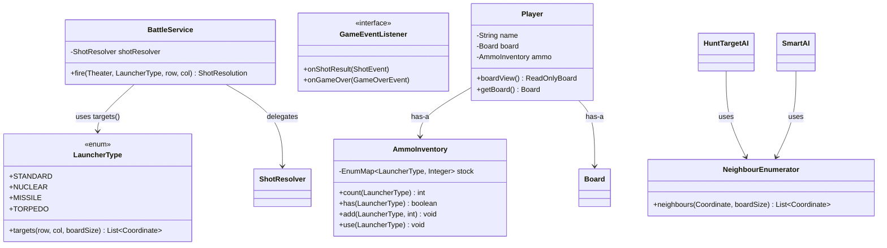

## Architecture Violations

### 1. 🔴 OCP Violation — Weapon/Launcher System

**Where:** [BattleService.java](file:///home/debrouillez-vous/Downloads/Projects/vB/battleshipGameOOP/src/main/java/com/battleship/controller/BattleService.java), [GameController.java](file:///home/debrouillez-vous/Downloads/Projects/vB/battleshipGameOOP/src/main/java/com/battleship/controller/GameController.java#L95-L120), [LauncherType.java](file:///home/debrouillez-vous/Downloads/Projects/vB/battleshipGameOOP/src/main/java/com/battleship/model/LauncherType.java)

**The Problem:**  
`BattleService` has **four separate methods** — `fireShot()`, `fireNuclearShot()`, `fireMissileShot()`, `fireTorpedoShot()` — each duplicating the same resolve-aggregate-check pattern. `GameController.humanFire()` uses a `switch(launcher)` to dispatch to them. Meanwhile, `LauncherType` already declares `affectedOffsets()` but nobody calls it.

**Why it's bad:**  
Adding a new weapon (e.g., DEPTH_CHARGE) requires changes in **at least 4 files**: `LauncherType`, `BattleService` (new method), `GameController` (new switch case), `AmmoInventory` (new counter + methods), and the view (new button). This is the textbook definition of an OCP violation.

> [!CAUTION]
> The code itself documents this problem! `LauncherType` has a Javadoc comment: *"Future OCP refactor: move the resolve loop into `LauncherType.fire(Board, int, int)` so adding a weapon never touches existing code."* — The student identified the issue but didn't fix it.
---

## Summary of Key Refactoring Impact

| Before | After | Principle Served |
|---|---|---|
| 4 fire methods in `BattleService` | 1 polymorphic `fire()` method | **OCP, DRY** |
| `switch(launcher)` in `GameController` | Direct delegation, no switch | **OCP, Polymorphism** |
| 12 per-type methods in `AmmoInventory` | 4 generic methods via `EnumMap` | **OCP, DRY** |
| Duplicated `enqueueNeighbours()` in 2 AIs | Shared `NeighbourEnumerator` | **DRY** |
| `int[]` arrays for coordinates | `Coordinate` record everywhere | **No Primitive Obsession** |
| Direct `new View()` navigation | `ViewNavigator` / Router pattern | **Loose Coupling** |
| `Player.getBoard()` always returns mutable | `Player.boardView()` as default, mutable as opt-in | **Encapsulation** |

---

## Appendix: What the Project Does Well 👏

It's important to note what's **strong** — this isn't a bad project:

1. **Records for value objects** — `Coordinate`, `ShotResolution`, `Theater`, `NetMessage`, `QuizQuestion` are all records. Excellent modern Java.
2. **Strategy pattern for AI** — `AIStrategy` + `AIFactory` is textbook correct.
3. **Null Object pattern** — `SilentAudio` avoids null checks. Clean.
4. **Template Method for views** — `AbstractBattleView` and `AbstractShipPlaceView` provide shared scaffolding without repeating layout code.
5. **Composition over inheritance** — `Player` has-a `Board` and has-a `AmmoInventory`. `BoardGridPane` has-a `GridPane` instead of extending it. `AI` classes have-a `TargetingQueue`.
6. **Read-only proxy** — `ReadOnlyBoard` prevents AI from cheating. Lightweight and effective.
7. **SRP extraction** — `ShotResolver`, `PlacementService`, `NetMessageCodec`, `NetworkFireService` all demonstrate conscious responsibility separation.
8. **Self-documenting Javadoc** — Almost every class has OOP-principle annotations in its Javadoc. The student clearly understands the concepts even where implementation falls short.


---

### 2. 🟠 Encapsulation Leak — `Player.getBoard()` Returns Mutable Board

**Where:** [Player.java](file:///home/debrouillez-vous/Downloads/Projects/vB/battleshipGameOOP/src/main/java/com/battleship/model/Player.java#L36)

**The Problem:**  
`Player.getBoard()` returns the raw `Board` object, allowing any caller to call `setCell()`, `clearShips()`, `placeShip()`, or `restoreGrid()` — completely bypassing the Player's own API.

**Why it's bad:**  
The `ReadOnlyBoard` wrapper exists and is used for the AI, but the controller and view both operate on the raw `Board` freely. This means the "encapsulation" documented in `Player`'s Javadoc is aspirational, not real. Any code with a `Player` reference has full write access to its board.

---

### 3. 🟠 SRP Violation — `LocalBattleView` is a Borderline God Object

**Where:** [LocalBattleView.java](file:///home/debrouillez-vous/Downloads/Projects/vB/battleshipGameOOP/src/main/java/com/battleship/view/LocalBattleView.java) (514 lines)

**The Problem:**  
This single class handles:
1. Human shot validation & dispatch
2. Weapon-type gating (ammo checks + quiz modals)
3. Audio playback decisions  
4. AI turn sequencing with timed delays
5. HUD refresh orchestration
6. Resupply quiz scheduling (every 5 rounds)
7. Game-over detection and screen transitions
8. Save-game serialisation

**Why it's bad:**  
Modifying any one concern (e.g., how resupply works, or when the game ends) risks breaking unrelated logic. Testing any single behaviour requires constructing the entire view. The class has **8 distinct responsibilities** — SRP says it should have **one**.

---

### 4. 🟠 Primitive Obsession — `int[]` Instead of `Coordinate`

**Where:** [BattleService.java](file:///home/debrouillez-vous/Downloads/Projects/vB/battleshipGameOOP/src/main/java/com/battleship/controller/BattleService.java#L32-L48)

**The Problem:**  
`BattleService` builds `List<int[]>` for blast-pattern targets:
```java
List<int[]> targets = new ArrayList<>();
targets.add(new int[]{row, col});
```
The project already has a `Coordinate` record designed to solve exactly this problem.

**Why it's bad:**  
Raw `int[]` loses type safety, has no meaningful `equals()`/`hashCode()`, and obscures intent. The `Coordinate` class exists — it should be used.

---

### 5. 🟡 Tight Coupling — View Navigation via Direct Construction

**Where:** All view classes (e.g., [GameModeSelectView.java](file:///home/debrouillez-vous/Downloads/Projects/vB/battleshipGameOOP/src/main/java/com/battleship/view/GameModeSelectView.java#L71), [BoardSelectView.java](file:///home/debrouillez-vous/Downloads/Projects/vB/battleshipGameOOP/src/main/java/com/battleship/view/BoardSelectView.java#L58))

**The Problem:**  
Views create each other directly: `new BoardSelectView(stage, difficulty).show()`. This creates a web of concrete dependencies: every view knows every other view it can navigate to.

**Why it's bad:**  
- You cannot unit-test navigation without constructing real JavaFX stages.  
- Adding a new screen requires modifying every view that links to it.  
- `ViewNavigator` exists but is barely used (only 3 methods, none called by the main flow).

---

### 6. 🟡 Duplicate Logic — `enqueueNeighbours()` Copied Across AIs

**Where:** [HuntTargetAI.java](file:///home/debrouillez-vous/Downloads/Projects/vB/battleshipGameOOP/src/main/java/com/battleship/ai/HuntTargetAI.java#L45-L51), [SmartAI.java](file:///home/debrouillez-vous/Downloads/Projects/vB/battleshipGameOOP/src/main/java/com/battleship/ai/SmartAI.java#L120-L126)

**The Problem:**  
Both `HuntTargetAI` and `SmartAI` have identical `enqueueNeighbours()` methods. `TargetingQueue` was extracted to share queue logic, but the neighbour-enumeration logic was not.

---

### 7. 🟡 Broken Ship Transfer in `ShipPlaceView.onAllShipsPlaced()`

**Where:** [ShipPlaceView.java](file:///home/debrouillez-vous/Downloads/Projects/vB/battleshipGameOOP/src/main/java/com/battleship/view/ShipPlaceView.java#L29-L47)

**The Problem:**  
```java
controller.getHumanPlayer().getBoard().clearShips();
for (var ship : board.getShips()) {
    // Ships are already placed on `board`; we snapshot the grid
    // ... (comment, no code)
}
```
The loop body is **empty**. The ship list in the controller's board is cleared and never repopulated. This means `allShipsSunk()` will always return `true` (empty list → vacuously true on `stream().allMatch()`), or the game logic is incorrect.

> [!WARNING]
> This is likely a **runtime bug**, not just a design issue. The `Board.allShipsSunk()` method returns `!ships.isEmpty() && ships.stream().allMatch(Ship::isSunk)`. Because ships are cleared but never re-added, `ships.isEmpty()` is `true`, so `allShipsSunk()` returns `false` — the game will **never end** via sinking detection on the human side.

---

### 8. 🟡 `AmmoInventory` — Repeated Per-Type Methods (Primitive Obsession Variant)

**Where:** [AmmoInventory.java](file:///home/debrouillez-vous/Downloads/Projects/vB/battleshipGameOOP/src/main/java/com/battleship/model/AmmoInventory.java)

**The Problem:**  
Three nearly identical method groups:
```java
public int getNuclearCount()  { ... }
public boolean hasNuclear()   { ... }
public void addNuclear(int n) { ... }
public void useNuclear()      { ... }
// × 3 for nuclear, missile, torpedo
```
12 methods doing the same thing parameterised by type. Adding a new ammo type requires adding 4 more methods.

---

### 9. 🟡 `SoundManager.createAudio()` Called Per-Shot

**Where:** [SoundManager.java](file:///home/debrouillez-vous/Downloads/Projects/vB/battleshipGameOOP/src/main/java/com/battleship/view/SoundManager.java#L45-L55)

**The Problem:**  
The convenience methods (`playHit()`, `playMiss()`, etc.) call `createAudio()` each time, instantiating a new `SfxAudio` (and its `SoundGenerator`) on every invocation. This is wasteful — the factory should cache the instance or these statics should be removed in favour of the instance already held by the battle views.

---

## Suggested Design Patterns

### 1. **Strategy Pattern (Completion)** — Polymorphic Weapons

The `LauncherType` enum already defines `affectedOffsets()`. Complete the pattern by giving each launcher a `fire()` method:

```java
public enum LauncherType {
    STANDARD {
        @Override
        public List<Coordinate> targets(int row, int col, int boardSize) {
            return List.of(new Coordinate(row, col));
        }
    },
    NUCLEAR {
        @Override
        public List<Coordinate> targets(int row, int col, int boardSize) {
            var list = new ArrayList<>(List.of(new Coordinate(row, col)));
            if (row > 0)            list.add(new Coordinate(row - 1, col));
            if (row < boardSize - 1) list.add(new Coordinate(row + 1, col));
            if (col > 0)            list.add(new Coordinate(row, col - 1));
            if (col < boardSize - 1) list.add(new Coordinate(row, col + 1));
            return list;
        }
    },
    TORPEDO {
        @Override
        public List<Coordinate> targets(int row, int col, int boardSize) {
            var list = new ArrayList<Coordinate>();
            for (int c = 0; c < boardSize; c++) list.add(new Coordinate(row, c));
            return list;
        }
    };
    // etc.

    public abstract List<Coordinate> targets(int row, int col, int boardSize);
}
```

This collapses `BattleService` down to **one method** and satisfies OCP.

---

### 2. **Command Pattern** — Turn Actions

Wrap each fire action in a `Command` object for undo/replay and to decouple the view from the controller:

```java
public sealed interface GameCommand {
    ShotResolution execute();

    record FireCommand(BattleService service, Theater theater,
                       LauncherType launcher, int row, int col) 
            implements GameCommand {
        @Override
        public ShotResolution execute() {
            return service.fire(theater, launcher, row, col);
        }
    }
}
```

---

### 3. **Observer Pattern** — Game Events

Instead of the view directly calling `audio.playHit()` and `refreshHud()` inline, publish events and let listeners react:

```java
public interface GameEventListener {
    void onShotFired(ShotEvent event);
    void onGameOver(GameOverEvent event);
}
```

This decouples audio, HUD, and animation from the firing logic — shrinking `LocalBattleView` dramatically.

---

### 4. **State Pattern** — Game Phases

Replace the `GameState` enum + manual `if` checks with a State pattern:

```java
public sealed interface GamePhase {
    GamePhase handleClick(int row, int col);
    
    record Placing(...) implements GamePhase { ... }
    record Battle(...)  implements GamePhase { ... }
    record GameOver(...)implements GamePhase { ... }
}
```

---

### 5. **Mediator / Router Pattern** — View Navigation

Centralise navigation through a proper router instead of direct `new` construction:

```java
public class ViewRouter {
    private final Stage stage;
    
    public void navigateTo(ViewId id, Map<String, Object> params) {
        switch (id) {
            case MAIN_MENU    -> new MainMenuView(stage).show();
            case BOARD_SELECT -> new BoardSelectView(stage, 
                    (String) params.get("difficulty")).show();
            // ...
        }
    }
}
```

---

### 6. **Map-Based Inventory** — Replace Repetitive Ammo Methods

```java
public class AmmoInventory {
    private final EnumMap<LauncherType, Integer> stock = new EnumMap<>(LauncherType.class);

    public int count(LauncherType type)   { return stock.getOrDefault(type, 0); }
    public boolean has(LauncherType type) { return count(type) > 0; }
    public void add(LauncherType type, int n) { stock.merge(type, n, Integer::sum); }
    public void use(LauncherType type) { 
        if (has(type)) stock.merge(type, -1, Integer::sum); 
    }
}
```

Adding a new weapon type requires **zero changes** to `AmmoInventory`.

---

## Refactored Design & Code

Below are the key structural refactorings. I present the **class diagram** and then the **refactored source**.

### Refactored Architecture (Class Diagram)



---

### Refactored File 1: `LauncherType.java` — Polymorphic Weapon Targets

```java
package com.battleship.model;

import java.util.ArrayList;
import java.util.List;

/**
 * Available launcher (weapon) types.
 *
 * <p>Each type defines its own blast pattern through {@link #targets},
 * satisfying the <b>Open/Closed Principle</b>: add a new weapon by adding
 * an enum constant — no changes required in BattleService.</p>
 */
public enum LauncherType {

    STANDARD {
        @Override
        public List<Coordinate> targets(int row, int col, int boardSize) {
            return List.of(new Coordinate(row, col));
        }
    },

    NUCLEAR {
        @Override
        public List<Coordinate> targets(int row, int col, int boardSize) {
            List<Coordinate> t = new ArrayList<>();
            t.add(new Coordinate(row, col));
            if (row > 0)              t.add(new Coordinate(row - 1, col));
            if (row < boardSize - 1)  t.add(new Coordinate(row + 1, col));
            if (col > 0)              t.add(new Coordinate(row, col - 1));
            if (col < boardSize - 1)  t.add(new Coordinate(row, col + 1));
            return t;
        }
    },

    MISSILE {
        @Override
        public List<Coordinate> targets(int row, int col, int boardSize) {
            List<Coordinate> t = new ArrayList<>();
            for (int dr = -1; dr <= 1; dr++)
                for (int dc = -1; dc <= 1; dc++) {
                    int r2 = row + dr, c2 = col + dc;
                    if (r2 >= 0 && r2 < boardSize && c2 >= 0 && c2 < boardSize)
                        t.add(new Coordinate(r2, c2));
                }
            return t;
        }
    },

    TORPEDO {
        @Override
        public List<Coordinate> targets(int row, int col, int boardSize) {
            List<Coordinate> t = new ArrayList<>();
            for (int c = 0; c < boardSize; c++)
                t.add(new Coordinate(row, c));
            return t;
        }
    };

    /**
     * Compute all cells affected when this launcher fires at (row, col).
     * Each enum constant provides its own implementation (polymorphism).
     */
    public abstract List<Coordinate> targets(int row, int col, int boardSize);
}
```

---

### Refactored File 2: `BattleService.java` — Single Polymorphic Fire Method

```java
package com.battleship.controller;

import com.battleship.model.*;

import java.util.List;

/**
 * Domain service: resolves a shot, updates both boards,
 * and decides the next game state.
 *
 * <p><b>OCP:</b> a single {@link #fire} method handles all launcher types
 * by delegating target computation to {@link LauncherType#targets}.
 * Adding a new weapon requires <em>zero changes</em> here.</p>
 */
public class BattleService {

    private final ShotResolver shotResolver;

    public BattleService() {
        this.shotResolver = new ShotResolver();
    }

    /**
     * Fire using the given launcher at (row, col) on the defender's board.
     *
     * @param theater  the attacker/defender pair
     * @param launcher the weapon type (determines blast pattern)
     * @param row      target row
     * @param col      target column
     * @return resolution containing the aggregated result and next game state
     */
    public ShotResolution fire(Theater theater, LauncherType launcher,
                               int row, int col) {
        Board defender = theater.defenderBoard();
        Board attacker = theater.attackerBoard();

        List<Coordinate> targets = launcher.targets(row, col, defender.size());

        ShotResult aggregated = ShotResult.MISS;
        for (Coordinate t : targets) {
            ShotResult r = shotResolver.resolve(defender, t.row(), t.col());
            attacker.markTracking(t.row(), t.col(), r);
            if (r == ShotResult.SUNK)
                aggregated = ShotResult.SUNK;
            else if (r == ShotResult.HIT && aggregated != ShotResult.SUNK)
                aggregated = ShotResult.HIT;
        }

        GameState next = defender.allShipsSunk()
                ? GameState.GAME_OVER
                : GameState.BATTLE;
        return new ShotResolution(aggregated, next);
    }
}
```

---

### Refactored File 3: `AmmoInventory.java` — Map-Based, OCP-Compliant

```java
package com.battleship.model;

import java.util.EnumMap;

/**
 * Tracks the remaining counts of each special launcher type.
 *
 * <p><b>OCP:</b> uses an {@link EnumMap} keyed by {@link LauncherType},
 * so adding a new launcher requires zero changes to this class.</p>
 *
 * <p><b>Encapsulation:</b> counts can only be modified via
 * {@link #add} and {@link #use} — no raw setters.</p>
 */
public class AmmoInventory {

    private final EnumMap<LauncherType, Integer> stock =
            new EnumMap<>(LauncherType.class);

    public AmmoInventory() {
        // All types start at 0 (STANDARD is unlimited, not tracked)
        for (LauncherType t : LauncherType.values()) {
            if (t != LauncherType.STANDARD) stock.put(t, 0);
        }
    }

    // ── Queries ───────────────────────────────────────────────

    public int count(LauncherType type) {
        return stock.getOrDefault(type, Integer.MAX_VALUE); // STANDARD = unlimited
    }

    public boolean has(LauncherType type) {
        return count(type) > 0;
    }

    public boolean hasAnySpecial() {
        return stock.values().stream().anyMatch(n -> n > 0);
    }

    // ── Commands ──────────────────────────────────────────────

    public void add(LauncherType type, int n) {
        if (type == LauncherType.STANDARD) return;
        stock.merge(type, n, Integer::sum);
    }

    public void use(LauncherType type) {
        if (type == LauncherType.STANDARD) return;
        stock.computeIfPresent(type, (k, v) -> v > 0 ? v - 1 : 0);
    }
}
```

---

### Refactored File 4: `GameController.humanFire()` — No More Switch

```java
    /**
     * Human fires at the AI board using the given launcher.
     * No switch/case needed — LauncherType handles its own targeting.
     */
    public ShotResolution humanFire(int row, int col, LauncherType launcher) {
        Theater theater = new Theater(humanPlayer, aiPlayer);
        
        // Validate ammo
        if (!humanPlayer.getAmmo().has(launcher)) {
            throw new IllegalStateException("No ammo for " + launcher);
        }

        ShotResolution res = battleService.fire(theater, launcher, row, col);
        humanPlayer.getAmmo().use(launcher);

        gameState = res.nextState();
        return res;
    }
```

---

### Refactored File 5: `NeighbourEnumerator.java` — DRY Utility

```java
package com.battleship.ai;

import com.battleship.model.Coordinate;
import java.util.ArrayList;
import java.util.List;

/**
 * Enumerates orthogonal neighbours of a coordinate within board bounds.
 * Shared by HuntTargetAI and SmartAI to eliminate duplicate code.
 */
public final class NeighbourEnumerator {

    private NeighbourEnumerator() {}

    public static List<Coordinate> orthogonal(Coordinate c, int boardSize) {
        List<Coordinate> result = new ArrayList<>(4);
        int r = c.row(), col = c.col();
        if (r > 0)              result.add(new Coordinate(r - 1, col));
        if (r < boardSize - 1)  result.add(new Coordinate(r + 1, col));
        if (col > 0)            result.add(new Coordinate(r, col - 1));
        if (col < boardSize - 1) result.add(new Coordinate(r, col + 1));
        return result;
    }
}
```

---

### Refactored File 6: `Player.java` — Tighter Encapsulation

```java
package com.battleship.model;

/**
 * A player in the game — owns a board and an ammo inventory.
 *
 * <p><b>Encapsulation:</b> external code receives a ReadOnlyBoard
 * by default. The mutable Board is only exposed to the controller
 * layer via package-private access or a dedicated method with
 * clear documentation of its mutability contract.</p>
 */
public class Player {

    private final String name;
    private final Board board;
    private final AmmoInventory ammo;
    private int totalHits = 0;
    private int totalMisses = 0;
    private boolean ready = false;

    public Player(String name, Board board) {
        this.name = name;
        this.board = board;
        this.ammo = new AmmoInventory();
    }

    // ── Safe queries ──────────────────────────────────────────

    public String getName()       { return name; }
    public ReadOnlyBoard boardView() { return board.asReadOnly(); }
    public AmmoInventory getAmmo()   { return ammo; }
    public int getTotalHits()     { return totalHits; }
    public int getTotalMisses()   { return totalMisses; }
    public boolean isReady()      { return ready; }

    public double accuracy() {
        int total = totalHits + totalMisses;
        return total == 0 ? 0.0 : (double) totalHits / total;
    }

    // ── Mutable board access (controller-only) ────────────────

    /**
     * Returns the mutable board. <b>Use with care</b> — prefer
     * {@link #boardView()} for read operations.
     */
    public Board getBoard() { return board; }

    // ── Commands ──────────────────────────────────────────────

    public void recordHit()          { totalHits++; }
    public void recordMiss()         { totalMisses++; }
    public void setReady(boolean r)  { ready = r; }

    public void awardQuizAmmo() {
        ammo.add(LauncherType.NUCLEAR, 1);
        ammo.add(LauncherType.MISSILE, 1);
        ammo.add(LauncherType.TORPEDO, 1);
    }
}
```
