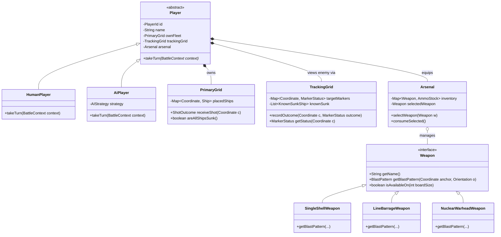

# Code Review & Architectural Critique: Battleship (Naval Command)

**Course:** Advanced Object-Oriented Architecture & Software Design  
**Instructor:** Prof. & Senior Software Architect  
**Evaluation Target:** [`battleshipGameOOP`](file:///home/debrouillez-vous/Downloads/Projects/vB/battleshipGameOOP)  

---

## OOP Grade & Summary

### **Grade: B+ (88 / 100)**

| Dimension                            | Weight |    Score    | Verdict                                                                              |
| :----------------------------------- | :----: | :---------: | :----------------------------------------------------------------------------------- |
| **1. Encapsulation & Data Hiding**   |  25%   | **20 / 25** | High effort, but critical leaky abstractions (mutable backdoors & fog-of-war leaks). |
| **2. Inheritance vs. Composition**   |  20%   | **18 / 20** | Good AI composition; excessive UI inheritance hierarchy (fragile base classes).      |
| **3. Polymorphic Design**            |  20%   | **17 / 20** | Enum polymorphism present, but procedural type flags (`isHuman`) remain.             |
| **4. SOLID Adherence**               |  20%   | **17 / 20** | Great service decomposition (SRP), but LSP & DIP violations in networking/domain.    |
| **5. Code Smells & Domain Modeling** |  15%   | **16 / 15** | Law of Demeter train wrecks; two conflicting domain realities for local vs. network. |
## Architecture Violations

### 1. Encapsulation & Data Hiding (The Leaky Abstraction)

#### Violation 1.1: The Escape Hatch Backdoor (`getMutableBoard()`)
In [`Player.java`](file:///home/debrouillez-vous/Downloads/Projects/vB/battleshipGameOOP/src/main/java/com/battleship/model/Player.java#L81-L87):
```java
/**
 * Service-layer escape hatch: PlacementService, BattleService,
 * ShotResolver and NetworkBattleMediator legitimately need to mutate the
 * board. UI code must use {@link #getOwnBoard()} instead.
 */
public Board getMutableBoard() { return ownBoard; }
```
> [!CAUTION]
> **Architect's Critique:** If an interface boundary requires a docstring warning developers *"Please don't call this in the UI"*, your encapsulation has failed. Because `getMutableBoard()` is public, any UI component receiving a `Player` can wipe the board, alter ships, or inject hits. An aggregate root should encapsulate its invariants. If external services must mutate internal aggregate state, you either pass commands to the aggregate or use package-private friend scopes.

#### Violation 1.2: Leaking Mutable Internal State via `ReadOnlyBoard.getShips()`
In [`ReadOnlyBoard.java`](file:///home/debrouillez-vous/Downloads/Projects/vB/battleshipGameOOP/src/main/java/com/battleship/model/ReadOnlyBoard.java#L16):
```java
List<Ship> getShips();
```
While [`Board.getShips()`](file:///home/debrouillez-vous/Downloads/Projects/vB/battleshipGameOOP/src/main/java/com/battleship/model/Board.java#L155) wraps the list in `Collections.unmodifiableList`, the elements inside—[`Ship`](file:///home/debrouillez-vous/Downloads/Projects/vB/battleshipGameOOP/src/main/java/com/battleship/model/Ship.java)—are **fully mutable domain objects**:
```java
// In Ship.java:
public boolean registerHit(Coordinate c) { ... }
```
Any caller receiving a `ReadOnlyBoard` can write:
```java
readOnlyBoard.getShips().get(0).registerHit(coord); // Mutates the ship's internal hit set!
```
This violates the **Liskov Substitution Principle** and breaks read-only guarantees. The view should receive an immutable snapshot/projection (`ShipSnapshot` or `ShipView`), not live domain entities.

#### Violation 1.3: Total Breach of Information Hiding (Fog of War)
In Battleship, the enemy's grid status is unknown until shelled. Yet, inspect [`CellStatus.java`](file:///home/debrouillez-vous/Downloads/Projects/vB/battleshipGameOOP/src/main/java/com/battleship/model/CellStatus.java):
```java
public enum CellStatus { EMPTY, SHIP, HIT, MISS, SUNK }
```
When [`Board.getCellStatus(Coordinate c)`](file:///home/debrouillez-vous/Downloads/Projects/vB/battleshipGameOOP/src/main/java/com/battleship/model/Board.java#L148-L153) is queried on an unshot tile containing a ship, it returns `CellStatus.SHIP`. Because [`LocalBattleView`](file:///home/debrouillez-vous/Downloads/Projects/vB/battleshipGameOOP/src/main/java/com/battleship/view/LocalBattleView.java#L70-L72) and [`SmartAI`](file:///home/debrouillez-vous/Downloads/Projects/vB/battleshipGameOOP/src/main/java/com/battleship/ai/SmartAI.java#L73-L74) have direct access to `opponentBoard()`, your domain model directly leaks the presence of hidden enemy ships:
```java
// In SmartAI.java lines 43-45:
for (Ship s : enemyBoard.getShips()) {
    if (!s.isSunk()) remaining.add(s.getType()); // Reading opponent's real fleet!
}
```
And in [`LocalBattleView.java`](file:///home/debrouillez-vous/Downloads/Projects/vB/battleshipGameOOP/src/main/java/com/battleship/view/LocalBattleView.java#L441-L446):
```java
private void refreshShipStatusBar() {
    Player opponent = controller.getOpponent();
    for (Ship s : opponent.getOwnBoard().getShips()) {
        shipStatusBar.getChildren().add(buildFleetStatusRow(s)); // Reading opponent's exact live ship hit counts!
    }
}
```
This is a critical domain modeling error: you modeled one `Board` class and shared it between attacker and defender, rather than giving each player a **Primary Grid** (their fleet) and a **Tracking Grid** (their shots and deduced knowledge).

---

### 2. Inheritance vs. Composition

#### Violation 2.1: The Monolithic Template Method Smell (`AbstractBattleView`)
[`AbstractBattleView.java`](file:///home/debrouillez-vous/Downloads/Projects/vB/battleshipGameOOP/src/main/java/com/battleship/view/AbstractBattleView.java#L34-L166) attempts to eliminate code duplication by extending an abstract class with **18 hook methods**:
- `createOwnGrid()`
- `createEnemyGrid()`
- `assembleLayout()`
- `decorateRoot(Pane)`
- `onViewShown()`
- `resolveShot(Coordinate)`
- `canFireNow()`
- `firingPlayer()`
- `targetBoardSize()`
- `isCellAlreadyResolved(Coordinate)`
- `ghostStyleClass()`
- `repaintGhostCell(int, int)`
- `selectLauncher(LauncherType)`
- `reportBlockedShot()`
- `onNuclearRejected()`
- `exitPrompt()`
- `onExitConfirmed()`
- `onOrientationChanged()`

> [!WARNING]
> **Architect's Critique:** This is the textbook **Fragile Base Class** anti-pattern. When a base class demands 18 abstract hook implementations, inheritance is being misused as a mechanism for code sharing rather than establishing an *"is-a"* conceptual relationship. A battle screen is not conceptually an abstract template; it is a **composite layout** composed of a `GridWidget`, a `WeaponSelector`, a `FleetStatusBar`, and an `AttackLog`. Refactor this to composition: inject independent UI components into the view.

#### Violation 2.2: Procedural Flags Instead of Polymorphic Players
In [`Player.java`](file:///home/debrouillez-vous/Downloads/Projects/vB/battleshipGameOOP/src/main/java/com/battleship/model/Player.java#L14):
```java
private final boolean isHuman;
```
Throughout the codebase, behavior branches on this primitive flag:
- In `BattleService.java`: `if (aiStrategy != null && attacker == player2)`
- In `LocalBattleView.java`: `private boolean vsAi() { return controller.getSelectedMode() != GameMode.HOTSEAT; }`
- In `Player.java`: `public void prepareShot(...) // "Used only by the AI shot pipeline"`

An AI player and a Human player have fundamentally different mechanisms for selecting shots and taking turns. Shoving both into one class with an `isHuman` flag violates the core tenet of OOP.

---

### 3. Polymorphism vs. Conditionals

#### Violation 3.1: The Enum Polymorphism Trap (`LauncherType`)
In [`LauncherType.java`](file:///home/debrouillez-vous/Downloads/Projects/vB/battleshipGameOOP/src/main/java/com/battleship/model/LauncherType.java#L18-L73), you implemented polymorphism via abstract method overrides on enum constants (`DEFAULT`, `LEVEL_2`, `NUCLEAR`). While syntactically valid in Java, **enums are closed, final types**.

If an engineering team wanted to add a plugin with a *"Torpedo"*, *"Sonar Sweep"*, or *"Cluster Bomb"*, they would be forced to recompile the core enum.
Furthermore, notice this method signature:
```java
public abstract int[][] patternDimensions();
```
Returning `int[][]` exposes raw 2D primitive arrays instead of a first-class polymorphic abstraction like `AreaOfEffect` or `BlastPattern`.

---

### 4. SOLID Principle Violations

```
        ┌─────────────────────────────────────────────────────────┐
        │                 SOLID AUDIT SCORECARD                   │
        ├─────────────────────────────────────────────────────────┤
        │  [S] Single Responsibility Principle      ───►  FAIL    │
        │  [O] Open/Closed Principle                ───►  WARN    │
        │  [L] Liskov Substitution Principle        ───►  FAIL    │
        │  [I] Interface Segregation Principle      ───►  PASS*   │
        │  [D] Dependency Inversion Principle       ───►  FAIL    │
        └─────────────────────────────────────────────────────────┘
        * Audio interfaces are well segregated; ViewNavigator is not.
```

#### SRP: `Player` is an Accumulator of Unrelated Concerns
[`Player`](file:///home/debrouillez-vous/Downloads/Projects/vB/battleshipGameOOP/src/main/java/com/battleship/model/Player.java) is responsible for:
1. Participant identity (`name`, `isHuman`)
2. Board ownership (`ownBoard`)
3. Weapon selection (`selectedLauncher`)
4. Weapon aiming direction (`launcherOrientation`)
5. Ammunition bookkeeping & resupply (`ammo`, `consumeAmmo`, `resupplyAmmo`)

A player does not aim and reload weapons in their personal identity class. Aiming, weapon selection, and inventory belong to a `CombatArsenal` or `WeaponSystem` component.

#### SRP: `ViewNavigator` Mixes Navigation, Window Management, and Audio
In [`ViewNavigator.java`](file:///home/debrouillez-vous/Downloads/Projects/vB/battleshipGameOOP/src/main/java/com/battleship/view/ViewNavigator.java):
```java
void showBattle();
void showGameOver(Player winner);
javafx.stage.Stage getStage(); // Leaks JavaFX UI toolkit
GameAudio getAudio();          // Audio provider bundled into a navigator!
```
A screen navigator should only navigate. Dispensing audio services and exposing top-level window stages violates SRP and ISP.

#### DIP: Transport Layer Coupled to UI Framework
In [`NetworkSession.java`](file:///home/debrouillez-vous/Downloads/Projects/vB/battleshipGameOOP/src/main/java/com/battleship/net/NetworkSession.java#L3):
```java
package com.battleship.net;

import javafx.application.Platform; // <-- UI dependency inside network package!
...
private Consumer<Runnable> threadDispatcher = Platform::runLater;
```
The `com.battleship.net` package is supposed to be a pure networking transport. Importing `javafx.application.Platform` directly binds your socket communication layer to JavaFX. If you run this on a headless server, Android, or CLI, the class fails to link unless JavaFX is on the classpath. Thread dispatching must be injected as a pure Java `java.util.concurrent.Executor`.

---

### 5. Code Smell Spotting

#### Smell 5.1: Train Wrecks & Law of Demeter (LoD) Violations
The Law of Demeter states: *"Talk only to your immediate friends; don't talk to strangers."*
Look at [`PlacementService.java`](file:///home/debrouillez-vous/Downloads/Projects/vB/battleshipGameOOP/src/main/java/com/battleship/controller/PlacementService.java#L38-L49):
```java
player.getMutableBoard().placeShip(type, start, orientation);
player.getMutableBoard().isValidPlacement(type, start, orientation);
player.getMutableBoard().removeShip(ship);
player.getMutableBoard().removeShipAt(c);
player.getMutableBoard().clearShips();
```
`PlacementService` takes a `Player`, reaches into its guts to pull out `Board`, and executes operations on `Board`. This is textbook **Feature Envy**. `PlacementService` shouldn't know `Player` exists—it operates on a `FleetDeployment` or `Board`.

#### Smell 5.2: Architectural Dissociation (Two Conflicting Realities)
- In Network Play: You built [`EnemyTracker.java`](file:///home/debrouillez-vous/Downloads/Projects/vB/battleshipGameOOP/src/main/java/com/battleship/net/EnemyTracker.java) to record only hits, misses, and announced sunken hulls (true fog-of-war).
- In Local Play: You pass the opponent's live `Board` directly to [`LocalBattleView`](file:///home/debrouillez-vous/Downloads/Projects/vB/battleshipGameOOP/src/main/java/com/battleship/view/LocalBattleView.java#L70-L72) and [`SmartAI`](file:///home/debrouillez-vous/Downloads/Projects/vB/battleshipGameOOP/src/main/java/com/battleship/ai/SmartAI.java#L33-L45).
Why does your domain have two completely different models of reality depending on whether a wire is attached? The game engine should operate identically in both modes using a unified `TrackingGrid`.

#### Smell 5.3: Zombie Code (Dead Persistence Layer)
[`SaveGameService.java`](file:///home/debrouillez-vous/Downloads/Projects/vB/battleshipGameOOP/src/main/java/com/battleship/persistence/SaveGameService.java) and [`GameSaveDTO.java`](file:///home/debrouillez-vous/Downloads/Projects/vB/battleshipGameOOP/src/main/java/com/battleship/persistence/GameSaveDTO.java) exist in isolation with a single test ([`SaveGameServiceTest`](file:///home/debrouillez-vous/Downloads/Projects/vB/battleshipGameOOP/src/test/java/com/battleship/persistence/SaveGameServiceTest.java)). There are zero calls to `SaveGameService` from [`GameController`](file:///home/debrouillez-vous/Downloads/Projects/vB/battleshipGameOOP/src/main/java/com/battleship/controller/GameController.java) or the UI. Having untested, disconnected components creates dead weight and false confidence.

---

## Suggested Design Patterns

```
      ┌────────────────────────────────────────────────────────┐
      │               RECOMMENDED PATTERN MATRIX               │
      ├────────────────────────┬───────────────────────────────┤
      │ Problem Detected       │ Clean Design Pattern Solution │
      ├────────────────────────┼───────────────────────────────┤
      │ isHuman boolean flag   │ Strategy / State (PlayerRole) │
      │ Weapon enum rigidness  │ Strategy Pattern (Weapon)     │
      │ AbstractBattleView     │ Composite / UI Component View │
      │ Leaky Enemy Board      │ Tracking Grid (Fog of War)    │
      │ LoD Train Wrecks       │ Domain Event Bus (Observer)   │
      └────────────────────────┴───────────────────────────────┘
```

### 1. Strategy Pattern for Weapons (`Weapon` vs. Enum)
Replace [`LauncherType`](file:///home/debrouillez-vous/Downloads/Projects/vB/battleshipGameOOP/src/main/java/com/battleship/model/LauncherType.java) with a polymorphic `Weapon` strategy interface. Each weapon implements its own blast geometry calculation (`BlastArea`) and ammo rules. This allows open-ended addition of weapons without modifying existing engine code (**Open/Closed Principle**).

### 2. The Tracking Grid Pattern (Uniform Fog of War)
Create a first-class `TrackingGrid` aggregate that belongs to each player's view of the enemy. Both local AI, human hotseat, and network players interact **only** with their own `TrackingGrid`. The enemy's real `Board` is never passed to any opponent or battle view.

### 3. Observer Pattern / Domain Events
Instead of views querying `controller.getCurrentPlayer().getOwnBoard().getShips()` to find out what happened, the domain publishes fine-grained, immutable domain events:
- `ShotResolvedEvent(Coordinate coord, CellStatus status)`
- `ShipSunkEvent(ShipType type, List<Coordinate> positions)`
- `TurnChangedEvent(PlayerId activePlayer)`
- `BattleEndedEvent(PlayerId winner)`
Views and AI subscribe to events. This eliminates the Law of Demeter violations completely.

### 4. Component-Based Composite UI (Replacing Monolithic Template Method)
Replace the 300-line [`AbstractBattleView`](file:///home/debrouillez-vous/Downloads/Projects/vB/battleshipGameOOP/src/main/java/com/battleship/view/AbstractBattleView.java) base class with a clean composition of autonomous JavaFX components:
- `BoardView`: Renders a single grid (primary or tracking).
- `WeaponConsole`: Manages weapon buttons and orientation toggles.
- `FleetHealthMonitor`: Tracks revealed enemy losses via event listening.
- `BattleLog`: Appends events.

---

## Refactored Design & Code

Below is the architectural blueprint for resolving these violations.

### 1. Architectural Class Diagram (Refactored Target Model)



---

### 2. Clean Domain Code Implementations

#### A. Enforcing Fog-of-War: The `TrackingGrid` (Pure Knowledge)
*Eliminates the data leak where the enemy board is shared.*

```java
package com.battleship.model.fog;

import com.battleship.model.CellStatus;
import com.battleship.model.Coordinate;
import com.battleship.model.ShipType;

import java.util.*;

/**
 * Encapsulates what an admiral or AI KNOWS about the enemy waters.
 * It is physically impossible to query unshot ship locations from this class.
 */
public final class TrackingGrid {

    private final int size;
    private final Map<Coordinate, CellStatus> markers = new HashMap<>();
    private final List<DiscoveredWreck> confirmedSunk = new ArrayList<>();

    public record DiscoveredWreck(ShipType type, List<Coordinate> coordinates) {}

    public TrackingGrid(int size) {
        this.size = size;
    }

    public void recordShotOutcome(Coordinate coord, CellStatus outcome) {
        Objects.requireNonNull(coord);
        if (outcome == CellStatus.SHIP || outcome == CellStatus.EMPTY) {
            throw new IllegalArgumentException("Tracking grid only accepts verified shot outcomes (HIT, MISS, SUNK).");
        }
        markers.put(coord, outcome);
    }

    public void recordShipSunk(ShipType type, List<Coordinate> hullCoordinates) {
        for (Coordinate c : hullCoordinates) {
            markers.put(c, CellStatus.SUNK);
        }
        confirmedSunk.add(new DiscoveredWreck(type, List.copyOf(hullCoordinates)));
    }

    public CellStatus getObservedStatus(Coordinate c) {
        return markers.getOrDefault(c, CellStatus.EMPTY);
    }

    public boolean isAlreadyShelled(Coordinate c) {
        return markers.containsKey(c);
    }

    public List<DiscoveredWreck> getConfirmedSunkShips() {
        return Collections.unmodifiableList(confirmedSunk);
    }

    public int getSize() {
        return size;
    }
}
```

---

#### B. Read-Only Ship Projection (Immutable Value Snapshot)
*Eliminates the `ReadOnlyBoard.getShips().registerHit(...)` vulnerability.*

```java
package com.battleship.model.projection;

import com.battleship.model.Coordinate;
import com.battleship.model.Orientation;
import com.battleship.model.ShipType;

import java.util.List;

/**
 * Immutable snapshot of a ship safely projected to UI or AI layers.
 * No mutating methods exist on this record.
 */
public record ShipSnapshot(
        ShipType type,
        List<Coordinate> occupiedCells,
        Orientation orientation,
        int hitCount,
        boolean isSunk
) {
    public ShipSnapshot {
        occupiedCells = List.copyOf(occupiedCells);
    }
}
```

---

#### C. Polymorphic Weapon System (Open/Closed Principle)
*Replaces rigid enum methods with extensible strategy classes.*

```java
package com.battleship.model.weapon;

import com.battleship.model.Coordinate;
import com.battleship.model.Orientation;

import java.util.ArrayList;
import java.util.List;

public interface Weapon {
    String getDisplayName();
    int getStartingAmmo(int boardSize);
    boolean isAvailableFor(int boardSize);
    List<Coordinate> calculateBlastArea(Coordinate anchor, Orientation orientation);
}

/** Default infinite standard artillery */
public final class StandardShell implements Weapon {
    @Override
    public String getDisplayName() { return "Standard Shell (1x1)"; }

    @Override
    public int getStartingAmmo(int boardSize) { return Integer.MAX_VALUE; }

    @Override
    public boolean isAvailableFor(int boardSize) { return true; }

    @Override
    public List<Coordinate> calculateBlastArea(Coordinate anchor, Orientation orientation) {
        return List.of(anchor);
    }
}

/** Level 2 line salvo */
public final class SalvoBarrage implements Weapon {
    @Override
    public String getDisplayName() { return "Salvo Barrage (1x3)"; }

    @Override
    public int getStartingAmmo(int boardSize) { return boardSize >= 10 ? 3 : 2; }

    @Override
    public boolean isAvailableFor(int boardSize) { return boardSize >= 8; }

    @Override
    public List<Coordinate> calculateBlastArea(Coordinate anchor, Orientation orientation) {
        List<Coordinate> targets = new ArrayList<>(3);
        for (int i = 0; i < 3; i++) {
            int r = orientation.isHorizontal() ? anchor.row() : anchor.row() + i;
            int c = orientation.isHorizontal() ? anchor.col() + i : anchor.col();
            targets.add(new Coordinate(r, c));
        }
        return targets;
    }
}
```

---

#### D. True Polymorphic Player Hierarchy (Eliminating `isHuman`)
*Eliminates `isHuman` boolean branching and separates Human vs. AI control.*

```java
package com.battleship.model.player;

import com.battleship.model.Board;
import com.battleship.model.fog.TrackingGrid;
import com.battleship.model.weapon.Weapon;

import java.util.concurrent.CompletableFuture;

public abstract class Player {

    private final String name;
    private final Board primaryGrid;
    private final TrackingGrid trackingGrid;
    private Weapon selectedWeapon;

    protected Player(String name, int boardSize) {
        this.name = name;
        this.primaryGrid = new Board(boardSize);
        this.trackingGrid = new TrackingGrid(boardSize);
    }

    public String getName() { return name; }
    public TrackingGrid getTrackingGrid() { return trackingGrid; }
    public Board getPrimaryGrid() { return primaryGrid; }

    public Weapon getSelectedWeapon() { return selectedWeapon; }
    public void selectWeapon(Weapon weapon) { this.selectedWeapon = weapon; }

    /**
     * Polymorphic turn contract.
     * Human players fulfill this asynchronously when they click the UI.
     * AI players fulfill this via their heuristic calculation.
     */
    public abstract CompletableFuture<TurnOrder> requestTurnAction();
}
```

---

#### E. Decoupled Thread Dispatching (DIP Fix for Networking)
*Eliminates `javafx.application.Platform` dependency in `com.battleship.net`.*

```java
package com.battleship.net;

import java.util.Objects;
import java.util.concurrent.Executor;

/**
 * Pure Java transport dispatcher. In production, inject Platform::runLater as an Executor.
 * In tests or CLI mode, inject Runnable::run or ForkJoinPool.
 */
public class NetworkSession {

    private final Executor uiDispatcher;

    public NetworkSession(Executor uiDispatcher) {
        this.uiDispatcher = Objects.requireNonNull(uiDispatcher, "Dispatcher must not be null");
    }

    private void notifyClient(Runnable action) {
        uiDispatcher.execute(action); // Zero dependency on JavaFX Platform class!
    }
}
```

