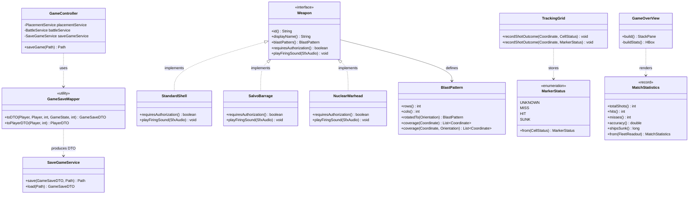

## 🔴 Must Fix

Severity: 🔴 **CRITICAL**  
File/Class: `com.battleship.view.AbstractBattleView` (and `LocalBattleView`, `NetworkBattleView`, `NetworkFireService`, `Player`)  
Method/Field: `AbstractBattleView.handleFireClick(Coordinate)`  
Problem: The firing pipeline performs manual runtime type-checking with `if (weapon instanceof NuclearWarhead)` twice—once to determine if launch authorization should be requested, and once to determine audio playback (`audio.playNuclear()` vs `audio.playFire()`). Furthermore, `Player` hardcodes `aimNuclear()`, and `NetworkFireService` hardcodes `resupplyNuclear(Player)`.  
Why it is a problem: Direct violation of Polymorphism and the Open/Closed Principle (OCP). Adding any new specialized weapon (such as `TorpedoAttack`, `LaserStrike`, or `ClusterBomb`) with distinct authorization requirements or custom audio forces modifications to `AbstractBattleView`, `LocalBattleView`, `NetworkBattleView`, `Player`, and `NetworkFireService`. The `Weapon` abstraction is leaky and fails to encapsulate weapon-specific execution behavior.  
What to change: Polymorphically push authorization checking and firing sound selection into the `Weapon` interface (`requiresAuthorization()`, `playFiringSound(SfxAudio)`). Remove `instanceof NuclearWarhead` branches and generalize ammo resupply to accept any `Weapon`.

---

Severity: 🔴 **CRITICAL**  
File/Class: `com.battleship.model.weapon.BlastPattern` and `com.battleship.ai.SmartAI`  
Method/Field: `BlastPattern.coverage(Coordinate, Orientation)` & `SmartAI.bestBlock(TrackingGrid, Weapon)`  
Problem: `SmartAI.bestBlock` attempts to evaluate area weapon effectiveness by manually rotating the blast pattern:
```java
BlastPattern laid = pattern.rotatedTo(orientation);
```
and bounding the scan with `laid.rows()` and `laid.cols()`, but then calls:
```java
laid.coverage(new Coordinate(r, c), orientation);
```
Because `BlastPattern.coverage` calls `rotatedTo(orientation)` internally on `laid`, passing `Orientation.VERTICAL` to an already vertically-rotated pattern transposes rows and columns a second time back to `HORIZONTAL`.  
Why it is a problem: A severe algorithmic defect and architectural design failure. For `SalvoBarrage` (1x3 base pattern), the AI iterates coordinates assuming a 3x1 vertical boundary, but tests 1x3 horizontal coordinates. The root cause is an ambiguous contract in `BlastPattern`: it acts simultaneously as an unoriented prototype and an oriented instance, while its methods unpredictably mutate orientation.  
What to change: Provide an orientation-independent `coverage(Coordinate anchor)` on oriented `BlastPattern` instances, or strictly call `coverage(anchor, orientation)` on the base unrotated pattern.

---

Severity: 🔴 **CRITICAL**  
File/Class: `com.battleship.controller.GameController`  
Method/Field: `toPlayerDTO(Player, int)`, `saveGame(Path)`, `loadGame(Path)`  
Problem: `GameController` acts as a God Object with low cohesion. In addition to orchestrating UI state transitions, mediating placement, and delegating turns, it directly owns JSON persistence data mapping by constructing DTO hierarchies and translating domain models (`Player`, `ShipSnapshot`, `Coordinate`) into `GameSaveDTO.PlayerDTO` and `ShipDTO`.  
Why it is a problem: Strong violation of the Single Responsibility Principle (SRP) and Layered Architecture. Presentation and workflow controllers should not know the schema or mapping details of persistence transfer objects. Modifying the persistence schema forces modifications to the application controller.  
What to change: Extract persistence mapping into a dedicated `GameSaveMapper` located in `com.battleship.persistence`, keeping `GameController` decoupled from DTO transformations.

---

## 🟠 Should Fix

Severity: 🟠 **HIGH**  
File/Class: `com.battleship.view.GameOverView`  
Method/Field: `buildStats()`  
Problem: The UI view iterates across board coordinates to compute match statistics:
```java
for (int r = 0; r < defenderFleet.size(); r++) {
    for (int c = 0; c < defenderFleet.size(); c++) {
        CellStatus status = defenderFleet.cellStatus(new Coordinate(r, c));
        if (status == CellStatus.HIT || status == CellStatus.SUNK) hits++;
        if (status == CellStatus.MISS) misses++;
    }
}
```
Why it is a problem: Domain logic leakage into the presentation layer. Scoring, accuracy calculation, and shot accounting belong to the domain/service model. If a headless test, network protocol, or alternative UI (e.g. web/console) needs game statistics, the logic cannot be reused and cannot be tested without launching JavaFX.  
What to change: Extract statistics calculation into a domain value object (`MatchStatistics`) computed by `FleetReadout` or `BattleService`. `GameOverView` should only format and render the resulting record.

---

Severity: 🟠 **HIGH**  
File/Class: `com.battleship.controller.BattleService` & `com.battleship.net.NetworkBattleMediator`  
Method/Field: `markerFor(CellStatus)`, `recordObservedOutcome(...)`, `recordObservedResult(...)`  
Problem: The mapping method `markerFor` from `CellStatus` to `MarkerStatus` is duplicated verbatim in both `BattleService` and `NetworkBattleMediator`. Furthermore, both classes implement the exact same loops to copy cell outcomes and sunk hulls into `TrackingGrid`.  
Why it is a problem: DRY violation and poor encapsulation. How domain shot outcomes map to Fog-of-War tracking markers is domain knowledge that belongs to `MarkerStatus` and `TrackingGrid`. Divergence between local and network tracking rules risks subtle synchronization bugs.  
What to change: Move conversion logic into `MarkerStatus.from(CellStatus)` and add unified shot outcome recording methods to `TrackingGrid`.

---

Severity: 🟠 **HIGH**  
File/Class: `com.battleship.view.NetworkBattleView` & `com.battleship.view.NetworkShipPlaceView`  
Method/Field: `handleMessage(NetMessage)`, `handleIncomingFire(NetMessage.Fire)`, `handleFireResult(NetMessage.FireResult)`  
Problem: Presentation views register network event handlers directly with the underlying socket (`netSession.getSession().setOnMessage(...)`), parse wire protocol messages, and directly alter game session state (e.g. `netSession.beginMyTurn()`, `netSession.beginOpponentTurn()`).  
Why it is a problem: Tight coupling between UI components and the network transport layer. The view assumes the responsibility of a network controller. Protocol state changes cannot be tested in isolation from the UI.  
What to change: Move socket message listening, turn transitions, and message dispatching out of the views and into `NetworkBattleMediator`, exposing only UI-bound event callbacks to the view.

---

Severity: 🟠 **HIGH**  
File/Class: `com.battleship.view.ImageResources` & `com.battleship.model.ShipType`  
Method/Field: `ImageResources.ship(ShipType, Orientation)`  
Problem: `ImageResources.ship` contains an exhaustive `switch (type)` statement over every enum value of `ShipType` to return asset file names ("destroyer", "submarine", "cruiser", etc.).  
Why it is a problem: Violates Open/Closed Principle (OCP). Introducing a new ship type (such as `STEALTH_SHIP`) requires editing existing presentation utility classes.  
What to change: Associate the asset key directly with the `ShipType` enum (or an asset identifier provider), eliminating the centralized switch statement.

---

## 🟡 Consider Fixing

Severity: 🟡 **MEDIUM**  
File/Class: `com.battleship.model.Player`  
Method/Field: `aimNuclear()`, `aimDefault()`, pass-through methods for `FleetDeployment` and `ShotTarget`  
Problem: `Player` acts as a heavy Middle-Man implementing 4 distinct interfaces (`FleetReadout`, `FleetDeployment`, `ShotTarget`, `AmmoReadout`) exclusively by forwarding dozens of calls to private internal aggregates `primaryGrid` and `arsenal`. It also includes redundant weapon-specific shortcut methods (`aimNuclear()`).  
Why it is a problem: Violates Interface Segregation Principle (ISP) and creates unnecessary pass-through boilerplate. Hardcoding specific weapon shortcuts on the player couples the player aggregate to specific entries in `WeaponCatalog`.  
What to change: Remove weapon-specific shortcuts like `aimNuclear()`. Restrict `Player` to aggregate root responsibilities and expose domain sub-components through role-oriented queries.

---

Severity: 🟡 **MEDIUM**  
File/Class: `com.battleship.model.weapon.WeaponCatalog` & `com.battleship.model.Arsenal`  
Method/Field: `WeaponCatalog.REGISTRY`, `Arsenal.Arsenal(int)`  
Problem: `WeaponCatalog` is a static mutable registry (`CopyOnWriteArrayList`), and `Arsenal` hardcodes a direct dependency on `WeaponCatalog.all()` inside its constructor.  
Why it is a problem: Violates Dependency Inversion Principle (DIP). Global static state impedes test isolation and prevents configuring different weapon rules per match or game mode.  
What to change: Allow `Arsenal` to receive an injectable `WeaponCatalog` or collection of available weapons rather than binding directly to a global static singleton.

---

Severity: 🟡 **MEDIUM**  
File/Class: `com.battleship.view.battle.BattleLog`, `com.battleship.view.battle.TargetModel`  
Method/Field: Entire classes  
Problem: `BattleLog` was implemented as a standalone composite UI component but is never used; `LocalBattleView` instead constructs its own private `attackLogList` and duplicate styling. `TargetModel` is an unused interface.  
Why it is a problem: Dead code adds maintenance confusion and indicates partial, abandoned refactoring.  
What to change: Integrate `BattleLog` into `LocalBattleView` and `NetworkBattleView` to consolidate duplicate UI logging code, and delete unused interface artifacts.

---

Severity: 🟡 **MEDIUM**  
File/Class: `com.battleship.ai.AIFactory`  
Method/Field: `create(GameMode)`  
Problem: `AIFactory.create(GameMode)` returns `null` when given `GameMode.HOTSEAT`.  
Why it is a problem: Returning `null` introduces temporal coupling and forces callers (`GameController.initializeGame`) to perform manual defensive conditional checks (`selectedMode == GameMode.HOTSEAT ? ... : ...`).  
What to change: Return `Optional<AIStrategy>` from `AIFactory.create(GameMode)`, or decouple mode selection from strategy factories by requiring an explicit `Difficulty` parameter.

---

## Design Patterns

Pattern: **Polymorphism / Strategy Pattern**  
Problem it solves: Eliminates `instanceof NuclearWarhead` branching in `AbstractBattleView` and weapon-specific methods (`aimNuclear`, `resupplyNuclear`).  
Where to apply it: `Weapon` interface and concrete implementations (`StandardShell`, `SalvoBarrage`, `NuclearWarhead`).  
Why it is justified: Fulfills the Open/Closed Principle. Allows any new weapon to declare its firing authorization requirements and sound playback behavior without modifying core battle views or controller services.

---

Pattern: **Data Mapper / Persistence Converter**  
Problem it solves: Removes DTO translation logic (`toPlayerDTO`) and JSON schema assembly from `GameController`.  
Where to apply it: `com.battleship.persistence.GameSaveMapper`.  
Why it is justified: Restores Single Responsibility Principle to `GameController` by separating game flow coordination from persistence data serialization.

---

Pattern: **Value Object / Domain Metric Extractor**  
Problem it solves: Removes coordinate-looping business math and hit/miss/accuracy calculations from `GameOverView.buildStats()`.  
Where to apply it: `com.battleship.model.MatchStatistics`.  
Why it is justified: Enforces Separation of Concerns by placing domain calculation rules inside the model layer, enabling independent unit testing and headless reuse.

---

## Target Architecture



---

## Refactored Code

Class: `com.battleship.model.weapon.Weapon`  
Responsibility: Contract for selectable weapons defining blast footprint, authorization constraints, and sound playback.  
Changes made: Added polymorphic `requiresAuthorization()` and `playFiringSound(SfxAudio)` to eliminate `instanceof` checks in battle views.

```java
package com.battleship.model.weapon;

import com.battleship.model.Coordinate;
import com.battleship.model.Orientation;
import com.battleship.view.SfxAudio;

import java.util.List;

public interface Weapon {

    String id();

    String displayName();

    int startingAmmo(int boardSize);

    boolean availableFor(int boardSize);

    boolean hasInfiniteAmmo();

    BlastPattern blastPattern();

    default List<Coordinate> calculateBlastArea(Coordinate anchor, Orientation orientation) {
        return blastPattern().coverage(anchor, orientation);
    }

    /** Whether this weapon requires confirmation/authorization before launching. */
    default boolean requiresAuthorization() {
        return false;
    }

    /** Polymorphic audio trigger for firing this weapon. */
    default void playFiringSound(SfxAudio audio) {
        audio.playFire();
    }
}
```

---

Class: `com.battleship.model.weapon.NuclearWarhead`  
Responsibility: Area warhead implementation of `Weapon`.  
Changes made: Overrode `requiresAuthorization()` and `playFiringSound(SfxAudio)` to encapsulate nuclear-specific behavior.

```java
package com.battleship.model.weapon;

import com.battleship.view.SfxAudio;

public final class NuclearWarhead implements Weapon {

    public static final String ID = "NUCLEAR";

    @Override
    public String id() {
        return ID;
    }

    @Override
    public String displayName() {
        return "Nuclear";
    }

    @Override
    public int startingAmmo(int boardSize) {
        return 1;
    }

    @Override
    public boolean availableFor(int boardSize) {
        return true;
    }

    @Override
    public boolean hasInfiniteAmmo() {
        return false;
    }

    @Override
    public BlastPattern blastPattern() {
        return BlastPattern.of(2, 3);
    }

    @Override
    public boolean requiresAuthorization() {
        return true;
    }

    @Override
    public void playFiringSound(SfxAudio audio) {
        audio.playNuclear();
    }
}
```

---

Class: `com.battleship.view.AbstractBattleView`  
Responsibility: Composite base view for battle screens.  
Changes made: Replaced `instanceof NuclearWarhead` checks with polymorphic calls to `weapon.requiresAuthorization()` and `weapon.playFiringSound(audio)`.

```java
package com.battleship.view;

import com.battleship.controller.GameController;
import com.battleship.model.Coordinate;
import com.battleship.model.Orientation;
import com.battleship.model.Player;
import com.battleship.model.weapon.Weapon;
import com.battleship.view.battle.WeaponConsole;
import com.battleship.view.quiz.NuclearLaunchDialog;
import javafx.scene.control.Alert;
import javafx.scene.control.Button;
import javafx.scene.control.ButtonType;
import javafx.scene.input.MouseButton;
import javafx.scene.layout.HBox;
import javafx.scene.layout.Pane;
import javafx.scene.layout.StackPane;

import java.util.ArrayList;
import java.util.List;
import java.util.Optional;

public abstract class AbstractBattleView {

    protected final ViewNavigator nav;
    protected final GameController controller;
    protected final GameAudio audio;

    protected BoardGridPane ownGrid;
    protected BoardGridPane enemyGrid;
    protected final WeaponConsole weaponConsole = new WeaponConsole();
    protected HBox launcherBar;

    private final List<Coordinate> ghostCells = new ArrayList<>();

    protected AbstractBattleView(ViewNavigator nav, GameController controller) {
        this.nav = nav;
        this.controller = controller;
        this.audio = nav.getAudio();
    }

    public final StackPane build() {
        launcherBar = weaponConsole.node();
        refreshLauncherBar();

        ownGrid = createOwnGrid();
        enemyGrid = createEnemyGrid();
        attachFireHandlers();

        Pane layout = assembleLayout();
        StackPane root = decorateRoot(layout);

        root.setFocusTraversable(true);
        root.setOnKeyPressed(e -> { if (e.getCode().toString().equals("R")) toggleOrientation(); });
        root.setOnMouseClicked(e -> { if (e.getButton() == MouseButton.SECONDARY) toggleOrientation(); });
        root.requestFocus();

        audio.playBattleMusic();
        onViewShown();
        return root;
    }

    protected abstract BoardGridPane createOwnGrid();
    protected abstract BoardGridPane createEnemyGrid();
    protected abstract Pane assembleLayout();
    protected abstract StackPane decorateRoot(Pane layout);
    protected abstract void onViewShown();
    protected abstract void resolveShot(Coordinate anchor);
    protected abstract boolean canFireNow();
    protected boolean extraWeaponGate() { return true; }
    protected abstract Player firingPlayer();
    protected abstract int targetBoardSize();
    protected abstract boolean isCellAlreadyResolved(Coordinate c);
    protected abstract String ghostStyleClass();
    protected abstract void repaintGhostCell(int row, int col);
    protected abstract void selectWeapon(Weapon weapon);
    protected abstract void reportBlockedShot();
    protected abstract void onNuclearRejected();

    protected final String orientationLabelText() {
        Orientation o = firingPlayer().weaponOrientation();
        return "Orientation: " + (o.isHorizontal() ? "HORIZONTAL" : "VERTICAL")
                + "  (R or Right-Click to rotate \u2014 affects Salvo / Nuclear)";
    }

    protected final void playResultAudio(boolean anyHit, boolean anySunk) {
        if (anySunk) {
            audio.playSunk();
        } else if (anyHit) {
            audio.playHit();
        } else {
            audio.playMiss();
        }
    }

    protected abstract String exitPrompt();
    protected void onExitConfirmed() { }
    protected abstract void onOrientationChanged();

    private void handleFireClick(Coordinate anchor) {
        if (!canFireNow()) return;

        Weapon weapon = firingPlayer().selectedWeapon();
        List<Coordinate> pattern = weapon.calculateBlastArea(anchor, firingOrientation());

        boolean anyLiveCell = pattern.stream().anyMatch(c ->
                c.isWithinBounds(targetBoardSize()) && !isCellAlreadyResolved(c));
        if (!anyLiveCell) {
            reportBlockedShot();
            return;
        }

        if (weapon.requiresAuthorization()) {
            boolean authorized = NuclearLaunchDialog.askAndAwaitAuthorization(enemyGrid.getScene().getWindow());
            if (!authorized) {
                onNuclearRejected();
                return;
            }
        }

        weapon.playFiringSound(audio);
        clearGhost();
        resolveShot(anchor);
    }

    protected final Orientation firingOrientation() {
        return firingPlayer().weaponOrientation();
    }

    private void attachFireHandlers() {
        int size = enemyGrid.getSize();
        for (int r = 0; r < size; r++) {
            for (int c = 0; c < size; c++) {
                final int row = r, col = c;
                enemyGrid.getCell(r, c).setOnMouseClicked(e -> handleFireClick(new Coordinate(row, col)));
                enemyGrid.getCell(r, c).setOnMouseEntered(e -> showGhost(row, col));
                enemyGrid.getCell(r, c).setOnMouseExited(e -> clearGhost());
            }
        }
    }

    private void showGhost(int row, int col) {
        if (!canFireNow()) return;
        clearGhost();
        Weapon weapon = firingPlayer().selectedWeapon();
        List<Coordinate> cells = weapon.calculateBlastArea(new Coordinate(row, col), firingOrientation());
        int size = enemyGrid.getSize();
        for (Coordinate c : cells) {
            if (!c.isWithinBounds(size)) continue;
            enemyGrid.setCellState(c, ghostStyleClass());
            ghostCells.add(c);
        }
    }

    private void clearGhost() {
        for (Coordinate gc : ghostCells) {
            repaintGhostCell(gc.getRow(), gc.getCol());
        }
        ghostCells.clear();
    }

    protected final void refreshLauncherBar() {
        weaponConsole.refresh(
                firingPlayer(),
                controller.getSelectedTheater().getBoardSize(),
                canFireNow() && extraWeaponGate(),
                weapon -> {
                    selectWeapon(weapon);
                    refreshLauncherBar();
                });
    }

    protected final void toggleOrientation() {
        firingPlayer().toggleWeaponOrientation();
        onOrientationChanged();
    }

    private void confirmExit() {
        Alert alert = new Alert(Alert.AlertType.CONFIRMATION);
        alert.setTitle("Exit Game");
        alert.setHeaderText(null);
        alert.setContentText(exitPrompt());
        Optional<ButtonType> result = alert.showAndWait();
        if (result.isPresent() && result.get() == ButtonType.OK) {
            onExitConfirmed();
            audio.stopBgm();
            audio.playMenuMusic();
            nav.showMainMenu();
        }
    }

    protected final Button buildExitButton() {
        Button exit = new Button("EXIT");
        exit.getStyleClass().add("danger-button");
        exit.setOnAction(e -> { audio.playClick(); confirmExit(); });
        return exit;
    }
}
```

---

Class: `com.battleship.model.weapon.BlastPattern`  
Responsibility: Geometry representation of a weapon's blast footprint.  
Changes made: Added parameterless `coverage(Coordinate anchor)` on oriented patterns to eliminate double-rotation defects in callers.

```java
package com.battleship.model.weapon;

import com.battleship.model.Coordinate;
import com.battleship.model.Orientation;

import java.util.ArrayList;
import java.util.List;

public record BlastPattern(int rows, int cols) {

    public BlastPattern {
        if (rows <= 0 || cols <= 0) {
            throw new IllegalArgumentException("A blast pattern needs positive dimensions, got "
                    + rows + "x" + cols);
        }
    }

    public static BlastPattern of(int rows, int cols) {
        return new BlastPattern(rows, cols);
    }

    public BlastPattern rotatedTo(Orientation orientation) {
        return orientation.isHorizontal() ? this : new BlastPattern(cols, rows);
    }

    public int cellCount() {
        return rows * cols;
    }

    public Orientation naturalOrientation() {
        return rows <= cols ? Orientation.HORIZONTAL : Orientation.VERTICAL;
    }

    /** Coordinates covered when oriented externally. */
    public List<Coordinate> coverage(Coordinate anchor) {
        List<Coordinate> cells = new ArrayList<>(cellCount());
        for (int r = 0; r < rows; r++) {
            for (int c = 0; c < cols; c++) {
                cells.add(new Coordinate(anchor.getRow() + r, anchor.getCol() + c));
            }
        }
        return cells;
    }

    /** Coordinates covered from a base pattern given an orientation. */
    public List<Coordinate> coverage(Coordinate anchor, Orientation orientation) {
        return rotatedTo(orientation).coverage(anchor);
    }

    public Coordinate clampAnchor(Coordinate anchor, Orientation orientation, int boardSize) {
        BlastPattern laid = rotatedTo(orientation);
        if (laid.rows() > boardSize || laid.cols() > boardSize) return null;
        int row = Math.min(anchor.getRow(), boardSize - laid.rows());
        int col = Math.min(anchor.getCol(), boardSize - laid.cols());
        return new Coordinate(row, col);
    }
}
```

---

Class: `com.battleship.ai.SmartAI`  
Responsibility: High-difficulty AI strategy building density maps.  
Changes made: Fixed double-rotation in `bestBlock` by calling `laid.coverage(new Coordinate(r, c))` directly on the oriented `BlastPattern`.

```java
package com.battleship.ai;

import com.battleship.model.AmmoReadout;
import com.battleship.model.CellStatus;
import com.battleship.model.Coordinate;
import com.battleship.model.Orientation;
import com.battleship.model.ShipType;
import com.battleship.model.ShotOrder;
import com.battleship.model.ShotResult;
import com.battleship.model.fog.MarkerStatus;
import com.battleship.model.fog.TrackingGrid;
import com.battleship.model.weapon.BlastPattern;
import com.battleship.model.weapon.Weapon;
import com.battleship.model.weapon.WeaponCatalog;

import java.security.SecureRandom;
import java.util.ArrayList;
import java.util.List;

public class SmartAI implements AIStrategy {

    private final TargetingQueue targetQueue = new TargetingQueue();
    private final SecureRandom random = new SecureRandom();
    private int lastBoardSize = -1;

    @Override
    public Coordinate chooseTarget(TrackingGrid knowledge) {
        lastBoardSize = knowledge.size();

        Coordinate queued = targetQueue.nextTarget(knowledge);
        if (queued != null) return queued;

        int size = knowledge.size();
        int[][] density = new int[size][size];
        List<ShipType> remaining = knowledge.remainingShipPool();
        if (remaining.isEmpty()) {
            return ParityHunter.pick(knowledge, random);
        }

        for (ShipType type : remaining) {
            int len = type.getSize();
            for (int r = 0; r < size; r++) {
                for (int c = 0; c <= size - len; c++) {
                    if (fits(knowledge, r, c, len, Orientation.HORIZONTAL)) {
                        for (int i = 0; i < len; i++) density[r][c + i]++;
                    }
                }
            }
            for (int c = 0; c < size; c++) {
                for (int r = 0; r <= size - len; r++) {
                    if (fits(knowledge, r, c, len, Orientation.VERTICAL)) {
                        for (int i = 0; i < len; i++) density[r + i][c]++;
                    }
                }
            }
        }

        int best = -1;
        List<Coordinate> bestCells = new ArrayList<>();
        for (int r = 0; r < size; r++) {
            for (int c = 0; c < size; c++) {
                Coordinate coord = new Coordinate(r, c);
                if (knowledge.isAlreadyShelled(coord)) continue;
                if (density[r][c] > best) {
                    best = density[r][c];
                    bestCells.clear();
                    bestCells.add(coord);
                } else if (density[r][c] == best) {
                    bestCells.add(coord);
                }
            }
        }

        if (bestCells.isEmpty()) return ParityHunter.pick(knowledge, random);
        return bestCells.get(random.nextInt(bestCells.size()));
    }

    @Override
    public void notifyResult(ShotResult result) {
        if (!result.isHit()) return;
        if (result.outcome() == CellStatus.SUNK) {
            targetQueue.clear();
            return;
        }
        targetQueue.enqueueNeighbors(result.coordinate(), lastBoardSize);
    }

    private boolean fits(TrackingGrid knowledge, int row, int col, int len, Orientation orientation) {
        for (int i = 0; i < len; i++) {
            int r = orientation.isHorizontal() ? row : row + i;
            int c = orientation.isHorizontal() ? col + i : col;
            MarkerStatus marker = knowledge.observedStatus(new Coordinate(r, c));
            if (marker == MarkerStatus.MISS || marker == MarkerStatus.SUNK) return false;
        }
        return true;
    }

    @Override
    public ShotOrder chooseShotPlan(TrackingGrid knowledge, AmmoReadout ammo) {
        if (targetQueue.hasTargets()) {
            return new ShotOrder(WeaponCatalog.standard(), chooseTarget(knowledge), Orientation.HORIZONTAL);
        }

        int size = knowledge.size();
        Weapon nuclear = WeaponCatalog.nuclear();
        if (ammo.hasAmmo(nuclear) && !ammo.isAmmoInfinite(nuclear) && size >= 10) {
            ShotOrder plan = bestBlock(knowledge, nuclear);
            if (plan != null) return plan;
        }
        Weapon salvo = WeaponCatalog.salvo();
        if (ammo.hasAmmo(salvo) && !ammo.isAmmoInfinite(salvo) && size >= 8) {
            ShotOrder plan = bestBlock(knowledge, salvo);
            if (plan != null) return plan;
        }
        return new ShotOrder(WeaponCatalog.standard(), chooseTarget(knowledge), Orientation.HORIZONTAL);
    }

    private ShotOrder bestBlock(TrackingGrid knowledge, Weapon weapon) {
        int size = knowledge.size();
        BlastPattern pattern = weapon.blastPattern();

        int bestScore = -1;
        Coordinate bestAnchor = null;
        Orientation bestOrientation = Orientation.HORIZONTAL;

        for (Orientation orientation : Orientation.values()) {
            BlastPattern laid = pattern.rotatedTo(orientation);
            for (int r = 0; r <= size - laid.rows(); r++) {
                for (int c = 0; c <= size - laid.cols(); c++) {
                    int score = 0;
                    // Fix: call parameterless coverage on the already-oriented pattern
                    for (Coordinate cell : laid.coverage(new Coordinate(r, c))) {
                        if (!knowledge.isAlreadyShelled(cell)) score++;
                    }
                    if (score > bestScore) {
                        bestScore = score;
                        bestAnchor = new Coordinate(r, c);
                        bestOrientation = orientation;
                    }
                }
            }
        }

        int totalCells = pattern.cellCount();
        if (bestAnchor == null || bestScore < (totalCells / 2 + 1)) return null;
        return new ShotOrder(weapon, bestAnchor, bestOrientation);
    }
}
```

---

Class: `com.battleship.model.fog.MarkerStatus`  
Responsibility: Closed marker set for Fog-of-War tracking.  
Changes made: Added static domain factory `from(CellStatus)` to eliminate duplicated mapping logic in controllers and network mediators.

```java
package com.battleship.model.fog;

import com.battleship.model.CellStatus;

public enum MarkerStatus {
    UNKNOWN,
    MISS,
    HIT,
    SUNK;

    public boolean isShelled() {
        return this != UNKNOWN;
    }

    /** Maps a resolved grid cell outcome into a fog-of-war tracking marker. */
    public static MarkerStatus from(CellStatus status) {
        return switch (status) {
            case HIT -> HIT;
            case SUNK -> SUNK;
            default -> MISS;
        };
    }
}
```

---

Class: `com.battleship.model.MatchStatistics`  
Responsibility: Immutable domain value object holding end-of-game statistics.  
Changes made: Extracted calculation logic out of `GameOverView.buildStats()` into this domain record.

```java
package com.battleship.model;

import com.battleship.model.projection.ShipSnapshot;

public record MatchStatistics(int totalShots, int hits, int misses, double accuracy, long shipsSunk) {

    public static MatchStatistics from(FleetReadout defenderFleet) {
        int hits = 0;
        int misses = 0;
        int size = defenderFleet.size();
        for (int r = 0; r < size; r++) {
            for (int c = 0; c < size; c++) {
                CellStatus status = defenderFleet.cellStatus(new Coordinate(r, c));
                if (status == CellStatus.HIT || status == CellStatus.SUNK) hits++;
                else if (status == CellStatus.MISS) misses++;
            }
        }
        int total = hits + misses;
        double accuracy = total == 0 ? 0.0 : (100.0 * hits / total);
        long shipsSunk = defenderFleet.fleet().stream().filter(ShipSnapshot::isSunk).count();
        return new MatchStatistics(total, hits, misses, accuracy, shipsSunk);
    }
}
```

---

Class: `com.battleship.view.GameOverView`  
Responsibility: View displaying end-of-game victory/defeat screen and board reveals.  
Changes made: Replaced nested grid iterations with calls to `MatchStatistics.from(defenderFleet)`.

```java
package com.battleship.view;

import com.battleship.controller.GameController;
import com.battleship.model.CellStatus;
import com.battleship.model.Coordinate;
import com.battleship.model.FleetReadout;
import com.battleship.model.MatchStatistics;
import com.battleship.model.Player;
import com.battleship.model.projection.ShipSnapshot;
import javafx.animation.FadeTransition;
import javafx.animation.TranslateTransition;
import javafx.geometry.Insets;
import javafx.geometry.Pos;
import javafx.scene.control.Button;
import javafx.scene.control.Label;
import javafx.scene.layout.HBox;
import javafx.scene.layout.Region;
import javafx.scene.layout.StackPane;
import javafx.scene.layout.VBox;
import javafx.scene.text.Font;
import javafx.scene.text.FontWeight;
import javafx.util.Duration;

public class GameOverView {

    private final ViewNavigator nav;
    private final GameController controller;
    private final Player winner;

    public GameOverView(ViewNavigator nav, GameController controller, Player winner) {
        this.nav = nav;
        this.controller = controller;
        this.winner = winner;
    }

    public StackPane build() {
        boolean playerWon = controller.isFirstPlayer(winner);
        nav.getAudio().playGameOver(playerWon);

        Label banner = new Label(playerWon ? "\uD83C\uDFC6  VICTORY" : "\u2620  DEFEAT");
        banner.setFont(Font.font("Arial Black", FontWeight.BOLD, 52));
        banner.getStyleClass().add(playerWon ? "app-title" : "defeat-banner");

        Label subtitle = new Label(playerWon
                ? "\u2693  THE ENEMY FLEET HAS BEEN DESTROYED  \u2693"
                : "\u2693  YOUR FLEET HAS BEEN LOST  \u2693");
        subtitle.setFont(Font.font("Arial", FontWeight.SEMI_BOLD, 13));
        subtitle.getStyleClass().add("app-subtitle");

        VBox ownBoard = revealedBoardCard("YOUR FLEET", controller.getPlayerFleet(1));
        VBox enemyBoard = revealedBoardCard(
                controller.getPlayerName(2).toUpperCase() + "'S FLEET", controller.getPlayerFleet(2));

        HBox boards = new HBox(28, ownBoard, enemyBoard);
        boards.setAlignment(Pos.CENTER);

        HBox stats = buildStats();

        Button reEngage = new Button("\u21bb  RE-ENGAGE");
        reEngage.setPrefWidth(190);
        reEngage.setPrefHeight(46);
        reEngage.getStyleClass().addAll("primary-button", "featured-button");
        reEngage.setOnAction(e -> { nav.getAudio().playClick(); nav.showBoardSelect(); });

        Button returnToPort = new Button("RETURN TO PORT");
        returnToPort.setPrefWidth(190);
        returnToPort.setPrefHeight(46);
        returnToPort.getStyleClass().add("ghost-button");
        returnToPort.setOnAction(e -> { nav.getAudio().playClick(); nav.getAudio().playMenuMusic(); nav.showMainMenu(); });

        HBox buttons = new HBox(16, reEngage, returnToPort);
        buttons.setAlignment(Pos.CENTER);

        VBox titleBlock = new VBox(6, banner, subtitle);
        titleBlock.setAlignment(Pos.CENTER);

        VBox layout = new VBox(22, titleBlock, boards, stats, buttons);
        layout.setAlignment(Pos.CENTER);
        layout.setPadding(new Insets(28, 24, 28, 24));

        StackPane root = new StackPane();
        javafx.scene.canvas.Canvas ocean = DecorUtil.animatedOceanScene(root, 0.0);
        root.getChildren().add(ocean);

        Region mood = new Region();
        mood.getStyleClass().add(playerWon ? "mood-wash-win" : "mood-wash-loss");
        mood.setMouseTransparent(true);
        mood.prefWidthProperty().bind(root.widthProperty());
        mood.prefHeightProperty().bind(root.heightProperty());
        root.getChildren().add(mood);

        root.getChildren().add(layout);

        layout.setOpacity(0.0);
        layout.setTranslateY(16);
        FadeTransition fade = new FadeTransition(Duration.millis(420), layout);
        fade.setToValue(1.0);
        TranslateTransition rise = new TranslateTransition(Duration.millis(420), layout);
        rise.setToY(0);
        fade.play();
        rise.play();

        return root;
    }

    private VBox revealedBoardCard(String label, FleetReadout fleet) {
        Label title = new Label(label);
        title.getStyleClass().add("board-card-title");

        BoardGridPane grid = new BoardGridPane(fleet.size());
        for (ShipSnapshot s : fleet.fleet()) {
            if (s.isSunk()) {
                grid.renderSunkShip(s.cells());
            } else {
                grid.renderShip(s);
            }
        }
        for (int r = 0; r < fleet.size(); r++) {
            for (int c = 0; c < fleet.size(); c++) {
                Coordinate coord = new Coordinate(r, c);
                if (fleet.cellStatus(coord) == CellStatus.MISS) {
                    grid.renderShot(coord, CellStatus.MISS);
                }
            }
        }

        VBox card = new VBox(14, title, grid);
        card.getStyleClass().add("board-card");
        card.setAlignment(Pos.CENTER);
        return card;
    }

    private HBox buildStats() {
        FleetReadout defenderFleet = controller.isFirstPlayer(winner)
                ? controller.getPlayerFleet(2)
                : controller.getPlayerFleet(1);

        MatchStatistics stats = MatchStatistics.from(defenderFleet);

        HBox row = new HBox(0,
                statPill("SHOTS FIRED", String.valueOf(stats.totalShots())),
                statDivider(),
                statPill("HITS", String.valueOf(stats.hits())),
                statDivider(),
                statPill("ACCURACY", String.format("%.1f%%", stats.accuracy())),
                statDivider(),
                statPill("SHIPS SUNK", String.valueOf(stats.shipsSunk())));
        row.getStyleClass().add("side-card");
        row.setAlignment(Pos.CENTER);
        row.setPadding(new Insets(16, 26, 16, 26));
        return row;
    }

    private VBox statPill(String label, String value) {
        Label v = new Label(value);
        v.getStyleClass().addAll("accent-text", "stat-pill-value");
        Label l = new Label(label);
        l.getStyleClass().add("dim-text");
        VBox box = new VBox(4, v, l);
        box.setAlignment(Pos.CENTER);
        box.setPadding(new Insets(0, 22, 0, 22));
        return box;
    }

    private Region statDivider() {
        Region divider = new Region();
        divider.getStyleClass().add("stat-divider");
        divider.setPrefWidth(1);
        divider.setMaxWidth(1);
        divider.setPrefHeight(34);
        return divider;
    }
}
```

---

Class: `com.battleship.persistence.GameSaveMapper`  
Responsibility: Translates domain aggregates into persistence transfer objects (`GameSaveDTO`).  
Changes made: Extracted from `GameController` to achieve SRP.

```java
package com.battleship.persistence;

import com.battleship.model.Coordinate;
import com.battleship.model.GameState;
import com.battleship.model.Player;
import com.battleship.model.projection.ShipSnapshot;

import java.time.Instant;
import java.util.ArrayList;
import java.util.List;

public final class GameSaveMapper {

    private GameSaveMapper() { }

    public static GameSaveDTO toDTO(Player player1, Player player2, int boardSize,
                                    GameState state, int currentPlayerIndex) {
        GameSaveDTO.PlayerDTO p1Dto = toPlayerDTO(player1, boardSize);
        GameSaveDTO.PlayerDTO p2Dto = toPlayerDTO(player2, boardSize);

        return GameSaveDTO.builder()
                .version("1.0.0")
                .timestamp(Instant.now().toString())
                .boardSize(boardSize)
                .gameState(state != null ? state.name() : "BATTLE")
                .player1(p1Dto)
                .player2(p2Dto)
                .currentPlayerIndex(currentPlayerIndex)
                .turnHistory(List.of())
                .build();
    }

    public static GameSaveDTO.PlayerDTO toPlayerDTO(Player player, int size) {
        String[][] board = new String[size][size];
        for (int r = 0; r < size; r++) {
            for (int c = 0; c < size; c++) {
                board[r][c] = player.cellStatus(new Coordinate(r, c)).name();
            }
        }
        List<GameSaveDTO.ShipDTO> ships = new ArrayList<>();
        for (ShipSnapshot s : player.fleet()) {
            List<String> coords = s.cells().stream().map(Coordinate::toString).toList();
            ships.add(new GameSaveDTO.ShipDTO(s.type().name(), s.hitCount(), coords));
        }
        return new GameSaveDTO.PlayerDTO(player.name(), player.isHuman(), board, ships);
    }
}
```

---

Class: `com.battleship.model.ShipType`  
Responsibility: Enum describing ship classes, lengths, and asset sprite keys.  
Changes made: Added `assetName` field and getter so asset resolution is open for extension without switch statements.

```java
package com.battleship.model;

/** Ship classes with fixed length in cells and associated visual asset name. */
public enum ShipType {
    PATROL_BOAT(2, "destroyer"),
    DESTROYER(2, "destroyer"),
    SUBMARINE(3, "submarine"),
    CRUISER(3, "cruiser"),
    BATTLESHIP(4, "battleship"),
    CARRIER(5, "carrier");

    private final int size;
    private final String assetName;

    ShipType(int size, String assetName) {
        this.size = size;
        this.assetName = assetName;
    }

    public int getSize() {
        return size;
    }

    public String getAssetName() {
        return assetName;
    }
}
```

---

## Refactoring Checklist

```text
[ ] Fix Weapon abstraction by adding requiresAuthorization() and playFiringSound(SfxAudio) to Weapon
[ ] Remove instanceof NuclearWarhead branches from AbstractBattleView.handleFireClick
[ ] Add parameterless coverage(Coordinate) to BlastPattern and fix double-rotation in SmartAI.bestBlock
[ ] Extract GameSaveMapper from GameController to isolate persistence DTO translation
[ ] Extract MatchStatistics from GameOverView to prevent domain math leakage into JavaFX views
[ ] Move duplicate markerFor mapping into MarkerStatus.from(CellStatus) and unify TrackingGrid updates
[ ] Move socket message handling and network turn transitions from NetworkBattleView into NetworkBattleMediator
[ ] Add assetName to ShipType and eliminate the exhaustive switch statement in ImageResources.ship
[ ] Remove weapon-specific methods (aimNuclear) from Player in favor of generic weapon selection
[ ] Delete unused TargetModel interface and integrate BattleLog into battle views
```