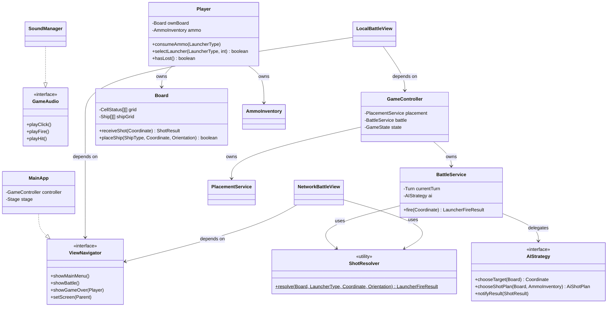

# 🎓 OOP Code Review — Battleship: Naval Command

**Reviewer:** Professor-level OOP & Architecture Review  
**Codebase:** ~61 Java files across 6 packages (`model`, `ai`, `controller`, `net`, `persistence`, `view`)  
**Framework:** JavaFX (desktop GUI)  

---

## OOP Grade & Summary

| Criterion | Grade | Verdict |
|---|---|---|
| **Encapsulation** | **A−** | Fields are consistently `private final` where appropriate. Rich domain objects. A few over-exposed accessors. |
| **Inheritance vs Composition** | **A** | Excellent: `SmartAI` composes `TargetingQueue` instead of extending `HuntTargetAI`. `AbstractBattleView` uses Template Method correctly. |
| **Polymorphism** | **A−** | Strategy pattern in AI. Sealed interface for net messages. `LauncherType` abstract methods. Minor `instanceof` usage in net handlers is justified (sealed hierarchy with pattern matching). |
| **SOLID Principles** | **B+** | Strong SRP split (controller → `BattleService` + `PlacementService`). OCP respected in `LauncherType`. `MainApp` takes on too many navigation responsibilities. View layer has SRP tension. |
| **Code Smell Density** | **B** | Some God-class tendencies in view layer. Primitive obsession in a few spots. `DecorUtil` is monolithic (~400+ lines of rendering). `NetworkBattleView` duplicates fire-resolution logic. |

### **Overall Grade: B+ / A−**

> **Executive Summary:** This is a strong OOP project that clearly demonstrates understanding of core principles. The model layer is well-designed with value objects (`Coordinate`, `ShotResult`), rich domain entities (`Board`, `Ship`, `Player`), and proper use of enums with behavior (`LauncherType`, `Theater`). The Strategy + Factory pattern in the AI package is textbook. The main weaknesses are concentrated in the **view layer** (oversized classes, some duplicated logic) and a **navigation design** that couples `MainApp` to every screen.

---

## 1. Encapsulation (Data Hiding)

### ✅ What's Done Well

- **Fields are consistently `private` (or `private final`)** across `Board`, `Ship`, `Player`, `AmmoInventory`, `TargetingQueue`, `NetworkSession`, etc. No public fields anywhere in the domain model.

- **Rich domain behavior instead of anemic models:**
  - [`Board`](file:///home/debrouillez-vous/Downloads/Projects/vB/battleshipGameOOP/src/main/java/com/battleship/model/Board.java) encapsulates shot resolution (`receiveShot`), placement validation (`isValidPlacement`), and grid state — it's not just a 2D array holder.
  - [`Ship`](file:///home/debrouillez-vous/Downloads/Projects/vB/battleshipGameOOP/src/main/java/com/battleship/model/Ship.java) tracks its own hit state and answers `isSunk()`.
  - [`Player`](file:///home/debrouillez-vous/Downloads/Projects/vB/battleshipGameOOP/src/main/java/com/battleship/model/Player.java) encapsulates launcher state — external code can only call `selectLauncher()`, `toggleLauncherOrientation()`, `prepareShot()`.

- **Defensive copies:** [`Ship`](file:///home/debrouillez-vous/Downloads/Projects/vB/battleshipGameOOP/src/main/java/com/battleship/model/Ship.java) returns `Collections.unmodifiableList(occupiedCells)`. [`Board.getShips()`](file:///home/debrouillez-vous/Downloads/Projects/vB/battleshipGameOOP/src/main/java/com/battleship/model/Board.java) returns an unmodifiable view. [`AiShotPlan`](file:///home/debrouillez-vous/Downloads/Projects/vB/battleshipGameOOP/src/main/java/com/battleship/ai/AiShotPlan.java) uses `List.copyOf()`.

- **`AmmoInventory`](file:///home/debrouillez-vous/Downloads/Projects/vB/battleshipGameOOP/src/main/java/com/battleship/model/AmmoInventory.java) throws `IllegalStateException` on consume-when-empty** — a proper invariant guard, not just silent failure.

### ⚠️ Violations

#### V1 — `Player.getAmmo()` leaks mutable internal state

```java
// Player.java — line ~84
public AmmoInventory getAmmo() { return ammo; }
```

`AmmoInventory` is a mutable object. Returning it directly lets any caller do `player.getAmmo().consume(...)` or `player.getAmmo().resupply(...)` — completely bypassing `Player`'s launcher-selection validation. The view and AI code both reach through Player to mutate ammo directly:

```java
// NetworkBattleView.java
me.getAmmo().consume(LauncherType.LEVEL_2);
me.getAmmo().resupply(LauncherType.NUCLEAR, 1);
```

**Why it's bad:** This is a *Law of Demeter* / *Tell, Don't Ask* violation. `Player` owns the invariant that "you can only fire if you have ammo and the weapon is available," but any caller can silently drain or refill ammo.

**Fix:** Delegate ammo operations through `Player`:

```java
// Player.java
public void consumeAmmo(LauncherType type) { ammo.consume(type); }
public void resupplyAmmo(LauncherType type, int amount) { ammo.resupply(type, amount); }
public int getAmmoCount(LauncherType type) { return ammo.getAmmo(type); }
// Remove getAmmo() entirely, or make it return a read-only view.
```

#### V2 — `Player.getOwnBoard()` exposes the full `Board` object

```java
public Board getOwnBoard() { return ownBoard; }
```

The `Board` object is fully mutable (ships can be placed, removed, shots received). While this is somewhat necessary for the controller and AI to interact with the board, it means `Player` doesn't truly "own" its board — anyone holding a `Player` reference can mutate the board at will.

**Mitigation (pragmatic):** In a purely academic context, `Player` should expose only high-level commands (`receiveShot(Coordinate)`, `placeShip(...)`) that proxy to the board. In this project, the exposure is acceptable because it's always the controller/service classes calling it — but the design should be documented as a conscious trade-off.

#### V3 — `EnemyTracker` grid is a raw 2D array with no access protection

```java
// EnemyTracker.java
private final CellStatus[][] grid;
public void recordMiss(Coordinate c) { grid[c.getRow()][c.getCol()] = CellStatus.MISS; }
public void recordHit(Coordinate c)  { grid[c.getRow()][c.getCol()] = CellStatus.HIT; }
```

While the field is private, there are no guards (e.g., bounds checking, duplicate-shot prevention). Compare with `Board.receiveShot()` which performs bounds checking and no-op on already-resolved cells. `EnemyTracker` should apply similar discipline.

---

## 2. Inheritance vs Composition

### ✅ What's Done Well

- **`SmartAI` composes `TargetingQueue` instead of extending `HuntTargetAI`** — this is explicitly called out in the Javadoc:

  > *"Uses composition (TargetingQueue) instead of inheriting from HuntTargetAI."*

  This is a perfect example of preferring composition for code reuse without the fragility of inheritance.

- **`AbstractBattleView` uses Template Method correctly** — it defines the shared fire pipeline (`handleFireClick`), ghost preview, weapon bar, and exit dialog, then delegates to subclass hooks (`resolveShot`, `canFireNow`, `createOwnGrid`, etc.). Both `LocalBattleView` and `NetworkBattleView` only override the genuinely different behavior.

- **No "extend for convenience" anti-patterns** — the three AI implementations all directly implement `AIStrategy`, not a linear inheritance chain.

### ⚠️ Minor Observations

#### O1 — `HuntTargetAI.isTargeting()` is `protected` but never actually called by any subclass

```java
// HuntTargetAI.java
protected boolean isTargeting() {
    return targetQueue.hasTargets();
}
```

This method is declared `protected` — suggesting it was designed for inheritance (subclasses peeking at superclass state). But `SmartAI` doesn't extend `HuntTargetAI`; it has its own `TargetingQueue`. This leftover suggests an earlier design that used inheritance. It should be removed or made `private`.

#### O2 — View classes extend JavaFX containers directly (`extends StackPane`, `extends VBox`, etc.) in the earlier version

Some view files (like the first `AbstractBattleView` version) extend `StackPane` directly. The final version shifts to a builder pattern (`build()` returns `StackPane`). This is the superior approach — favor composition over inheritance for UI assembly.

---

## 3. Polymorphism

### ✅ What's Done Well

- **Strategy Pattern — AI package** is textbook:

  ```
  AIStrategy (interface)
    ├── RandomAI       (Easy)
    ├── HuntTargetAI   (Medium)
    └── SmartAI        (Hard)
  ```

  The `BattleService` holds an `AIStrategy` reference and calls `chooseTarget()` / `chooseShotPlan()` / `notifyResult()` polymorphically. Adding a new difficulty is a one-class addition.

- **`LauncherType` enum with abstract methods** — each constant overrides `getTargetCells()`, `isAvailableFor()`, `getStartingAmmo()`, `patternDimensions()`. Adding a new weapon (e.g., TORPEDO) requires only a new enum constant. This is OCP-compliant polymorphism.

- **Sealed interface `NetMessage`** — exhaustive pattern matching in `NetMessageCodec.envelope()`:

  ```java
  String type = switch (msg) {
      case NetMessage.Hello h      -> "HELLO";
      case NetMessage.Welcome w    -> "WELCOME";
      // ... compiler enforces all variants handled
  };
  ```

  This is *correct* use of `instanceof`/pattern matching — the sealed hierarchy makes it safe and the compiler guarantees exhaustiveness.

- **`AIStrategy.chooseShotPlan()` default method** — the interface provides a sensible default that `RandomAI` inherits, while `HuntTargetAI` and `SmartAI` override it. This is good use of interface default methods to avoid forcing trivial implementations.

### ⚠️ Minor Violations

#### V4 — `NetMessageCodec.decode()` uses string-based dispatch instead of the sealed hierarchy

```java
// NetMessageCodec.java
return switch (type) {
    case "HELLO"       -> gson.fromJson(payload, NetMessage.Hello.class);
    case "WELCOME"     -> gson.fromJson(payload, NetMessage.Welcome.class);
    // ...
    default            -> null;
};
```

This is a necessary concession to Gson's limitations (it can't auto-discover sealed subtypes). But the `default -> null` silently swallows unknown messages. A better design would use a `Map<String, Class<? extends NetMessage>>` registry, or at minimum log a warning.

#### V5 — `BattleService.fire()` uses `==` on Player identity for AI notification

```java
if (aiStrategy != null && attacker == player2) {
    for (ShotResult r : results) aiStrategy.notifyResult(r);
}
```

This is a flag-style check ("is this the AI player?") rather than a polymorphic approach. A cleaner design would be to have `Player` itself know whether it's AI-controlled and delegate result notification.

---

## 4. SOLID Principles

### ✅ What's Done Well

#### SRP (Single Responsibility Principle)

- **Controller split into three classes:** `GameController` (thin mediator/flow coordinator), `PlacementService` (ship placement logic), `BattleService` (firing pipeline). This is explicitly documented:

  > *"Extracted from GameController so the controller can stay a thin mediator (SRP)."*

- **Model classes have focused responsibilities:**
  - `Board` = grid state + shot resolution
  - `Ship` = occupancy + hit tracking
  - `AmmoInventory` = ammo counting
  - `Theater` = fleet composition configuration
  - `Coordinate` = algebraic position (value object)

#### OCP (Open/Closed Principle)

- **`LauncherType`** is the star example. Each enum constant overrides abstract methods for blast pattern, availability, ammo rules, and dimensions. Adding a new weapon type requires exactly one new enum constant.

- **`AIStrategy` + `AIFactory`** — adding a new difficulty level requires one new class implementing `AIStrategy` and one new `case` in `AIFactory`.

#### DIP (Dependency Inversion Principle)

- `BattleService` depends on the `AIStrategy` interface, not on `RandomAI` / `SmartAI` directly.

### ⚠️ Violations

#### V6 — `MainApp` violates SRP: it's both the JavaFX Application and the Navigator

```java
// MainApp.java
public class MainApp extends Application {
    public void showMainMenu()     { setRoot(new MainMenuView(this).build()); }
    public void showModeSelect()   { ... }
    public void showBoardSelect()  { ... }
    public void showShipPlacement(){ ... }
    public void showBattle()       { ... }
    public void showGameOver(...)  { ... }
    public void showMultiplayerLobby() { ... }
    // ...
}
```

`MainApp` is simultaneously:
1. The JavaFX `Application` entry point
2. The screen navigator
3. The `GameController` owner

Every view class takes `MainApp` as a constructor parameter and calls back into it for navigation. This creates a **God Object** coupling — every view knows about `MainApp`, and `MainApp` knows about every view.

**Fix:** Extract a dedicated `ViewNavigator` interface (see Refactored Design below).

#### V7 — `GameController.getPlayer1()` / `getPlayer2()` break encapsulation of game state

```java
public Player getPlayer1() { return player1; }
public Player getPlayer2() { return player2; }
```

These expose the raw `Player` objects to every view. Since `Player` exposes `getOwnBoard()` (V2), any view holding the controller can reach deep into `controller.getPlayer1().getOwnBoard().receiveShot(...)`. The controller should expose only the operations it wants to allow.

#### V8 — `NetworkBattleView.handleIncomingFire()` duplicates `BattleService.fire()` logic

```java
// NetworkBattleView.java — handleIncomingFire()
for (Coordinate c : cells) {
    if (!c.isWithinBounds(myBoard.getSize())) continue;
    CellStatus existing = myBoard.getCellStatus(c);
    if (existing == CellStatus.HIT || ...) continue;
    ShotResult r = myBoard.receiveShot(c);
    results.add(r);
    if (r.outcome() == CellStatus.SUNK) sunk.add(r.shipSunk());
}
```

This is the same fire-resolution loop as `BattleService.fire()`, manually re-implemented in a view class. This violates both SRP (view doing domain logic) and DRY.

**Fix:** Extract a shared `ShotResolver` utility that both `BattleService` and `NetworkBattleView` use.

#### V9 — `NetworkBattleView.resolveShot()` does ammo bookkeeping

```java
// NetworkBattleView.java — resolveShot()
if (type == LauncherType.LEVEL_2) me.getAmmo().consume(LauncherType.LEVEL_2);
if (type == LauncherType.NUCLEAR) {
    me.getAmmo().consume(LauncherType.NUCLEAR);
    if (!me.getAmmo().hasAmmo(LauncherType.NUCLEAR)) {
        NuclearResupplyDialog.show(app.getStage(), () -> {
            me.getAmmo().resupply(LauncherType.NUCLEAR, 1);
        });
    }
}
me.resetLauncherAfterShot();
```

Ammo management is domain logic that belongs in a service layer, not a JavaFX view class. The view should only say "fire this shot" and let a service handle inventory.

---

## 5. Code Smell Spotting

### 🔴 God Objects

| Class | Lines (approx.) | Concern |
|---|---|---|
| [`DecorUtil`](file:///home/debrouillez-vous/Downloads/Projects/vB/battleshipGameOOP/src/main/java/com/battleship/view/DecorUtil.java) | ~500+ | Contains `animatedOceanScene()`, `lightSeaScene()`, `animatedRadarSweep()`, `animatedOceanRibbon()`, `compassWatermark()` — each is a self-contained animation factory. Should be split into separate classes. |
| [`NetworkBattleView`](file:///home/debrouillez-vous/Downloads/Projects/vB/battleshipGameOOP/src/main/java/com/battleship/view/NetworkBattleView.java) | ~250+ | Handles layout assembly, network message dispatch, shot resolution, ammo management, fleet status display, and game-over transition. |
| [`ShipPlaceView`](file:///home/debrouillez-vous/Downloads/Projects/vB/battleshipGameOOP/src/main/java/com/battleship/view/ShipPlaceView.java) | ~300+ (estimated) | Manages drag-and-drop, ghost preview, orientation toggle, ready-button flow, and board rendering. |
| [`MenuOverlays`](file:///home/debrouillez-vous/Downloads/Projects/vB/battleshipGameOOP/src/main/java/com/battleship/view/MenuOverlays.java) | ~190 | Acceptable for now but mixes two unrelated overlays (How To Play, Options) in one class. |

### 🟡 Primitive Obsession

#### P1 — Player index tracked as raw `int`

```java
// GameController.java
private int placingPlayerIndex;
// BattleService.java
private int currentPlayerIndex;
```

Instead of a dedicated enum or a `Turn` object, the current player is tracked with a raw `0` or `1`. The toggle logic `currentPlayerIndex = 1 - currentPlayerIndex` is clever but opaque. A `Turn` enum or a `TurnTracker` class would be self-documenting.

#### P2 — `int boardSize` scattered everywhere

Board size is passed as a bare `int` to `isAvailableFor(int)`, `getStartingAmmo(int)`, `TargetingQueue(int)`, etc. While creating a `BoardSize` value object might be overkill, the parameter name is often just `size` which is ambiguous.

#### P3 — `boolean isHost` in `NetworkGameSession`

```java
private final boolean isHost;
```

This flag drives branching logic in multiple places. A small `Role` enum (`HOST`, `CLIENT`) would be clearer and more extensible.

### 🟡 Tight Coupling

#### C1 — Every view takes `MainApp` as a constructor parameter

```java
public LocalBattleView(MainApp app, GameController controller) { ... }
public BoardSelectView(MainApp app, GameController controller) { ... }
public NetworkBattleView(MainApp app, GameController controller, NetworkGameSession netSession) { ... }
```

Views call `app.showMainMenu()`, `app.showModeSelect()`, `app.setScreen(...)` directly. This means:
- Views cannot be unit-tested without a live `MainApp` (which requires JavaFX runtime).
- Adding a new screen requires modifying `MainApp`.

**Fix:** Inject a `ViewNavigator` interface instead.

#### C2 — `SoundManager` accessed via `SoundManager.getInstance()` (static singleton) throughout all views

Every button action calls `SoundManager.getInstance().playClick()`. This is a classic testability killer — you can't mock or disable sounds in tests.

**Fix:** Inject `SoundManager` via the constructor or the navigator, or make it an interface with a `NullSoundManager` for testing.

---

## Suggested Design Patterns

| Pattern | Where | Benefit |
|---|---|---|
| **Strategy** ✅ | `AIStrategy` hierarchy | *Already implemented.* Clean separation of AI behaviors. |
| **Factory Method** ✅ | `AIFactory.create()` | *Already implemented.* Encapsulates AI instantiation. |
| **Template Method** ✅ | `AbstractBattleView` | *Already implemented.* Shared fire pipeline; subclasses override hooks. |
| **Builder** ✅ | `GameSaveDTO.Builder` | *Already implemented.* Validates invariants at construction. |
| **Mediator** | Extract `ViewNavigator` interface from `MainApp` | Decouples views from the Application class. |
| **Observer** | `GameController` → views via events | Replace callback-heavy `Consumer<GameState>` with a proper event bus or observable state. |
| **Facade** | `ShotResolver` service | Unify the duplicated fire-resolution logic into one reusable component. |
| **Null Object** | `NullSoundManager` | Testability: views use a sound interface, tests inject a silent implementation. |

---

## Refactored Design & Code

> [!IMPORTANT]
> The refactored code below targets the **architectural violations** identified above. View-layer UI code is left largely intact — the focus is on structural OOP improvements.

### Refactoring 1 — Extract `ViewNavigator` Interface (fixes V6, C1)

```java
// NEW FILE: com.battleship.view.ViewNavigator.java

package com.battleship.view;

import com.battleship.model.Player;
import com.battleship.net.NetworkGameSession;

/**
 * Abstraction for screen navigation. Views depend on this interface,
 * not on MainApp directly — enabling testability and decoupling.
 */
public interface ViewNavigator {
    void showMainMenu();
    void showModeSelect();
    void showBoardSelect();
    void showShipPlacement();
    void showPassScreen(Runnable onContinue);
    void showBattle();
    void showGameOver(Player winner);
    void showMultiplayerLobby();
    void showNetworkShipPlacement(NetworkGameSession session);
    void showNetworkBattle(NetworkGameSession session);
    void showNetworkGameOver(NetworkGameSession session, boolean won);

    /** Lets standalone screens push themselves directly. */
    void setScreen(javafx.scene.Parent root);
}
```

```java
// MODIFIED: MainApp.java implements ViewNavigator

public class MainApp extends Application implements ViewNavigator {
    // All existing showX() methods now satisfy the interface contract.
    // Views receive ViewNavigator, not MainApp:
    //   Before: new BoardSelectView(this, controller)
    //   After:  new BoardSelectView(this, controller)  // same call, but typed as ViewNavigator
}
```

All view constructors change from `MainApp app` to `ViewNavigator nav`:

```java
// Before:
public LocalBattleView(MainApp app, GameController controller) { ... }

// After:
public LocalBattleView(ViewNavigator nav, GameController controller) { ... }
```

---

### Refactoring 2 — Delegate Ammo Through `Player` (fixes V1)

```java
// MODIFIED: Player.java — replace getAmmo() with delegated methods

public class Player {
    // ... existing fields ...

    // REMOVE: public AmmoInventory getAmmo() { return ammo; }

    /** Returns the current ammo count for the given type. */
    public int getAmmoCount(LauncherType type) {
        return ammo != null ? ammo.getAmmo(type) : 0;
    }

    /** Returns true if the player has at least one shot of this type. */
    public boolean hasAmmo(LauncherType type) {
        return ammo != null && ammo.hasAmmo(type);
    }

    /** Consumes one unit of the given ammo type. */
    public void consumeAmmo(LauncherType type) {
        if (ammo != null) ammo.consume(type);
    }

    /** Adds ammo (e.g., nuclear resupply after quiz). */
    public void resupplyAmmo(LauncherType type, int amount) {
        if (ammo != null) ammo.resupply(type, amount);
    }

    /** True if this ammo type is infinite (e.g., DEFAULT). */
    public boolean isAmmoInfinite(LauncherType type) {
        return ammo != null && ammo.isInfinite(type);
    }
}
```

---

### Refactoring 3 — Extract `ShotResolver` (fixes V8, V9)

```java
// NEW FILE: com.battleship.controller.ShotResolver.java

package com.battleship.controller;

import com.battleship.model.Board;
import com.battleship.model.CellStatus;
import com.battleship.model.Coordinate;
import com.battleship.model.LauncherType;
import com.battleship.model.Orientation;
import com.battleship.model.Ship;
import com.battleship.model.ShotResult;

import java.util.ArrayList;
import java.util.LinkedHashSet;
import java.util.List;

/**
 * Reusable utility that resolves a launcher shot against a target board.
 * Used by both BattleService (local) and NetworkBattleView (defender side).
 * Eliminates the duplicated fire-resolution loop.
 */
public final class ShotResolver {

    private ShotResolver() {}

    /**
     * Fires the given launcher pattern against the target board.
     * Already-resolved cells and out-of-bounds cells are skipped.
     *
     * @return the aggregated result (per-cell outcomes + sunk ships)
     */
    public static LauncherFireResult resolve(
            Board targetBoard,
            LauncherType launcherType,
            Coordinate anchor,
            Orientation orientation) {

        int size = targetBoard.getSize();
        List<Coordinate> cells = launcherType.getTargetCells(anchor, orientation);
        List<ShotResult> results = new ArrayList<>();
        LinkedHashSet<Ship> sunk = new LinkedHashSet<>();

        for (Coordinate c : cells) {
            if (!c.isWithinBounds(size)) continue;
            CellStatus existing = targetBoard.getCellStatus(c);
            if (existing == CellStatus.HIT || existing == CellStatus.MISS
                    || existing == CellStatus.SUNK) continue;
            ShotResult r = targetBoard.receiveShot(c);
            results.add(r);
            if (r.outcome() == CellStatus.SUNK) sunk.add(r.shipSunk());
        }

        return new LauncherFireResult(results, new ArrayList<>(sunk));
    }
}
```

Then `BattleService.fire()` simplifies to:

```java
// MODIFIED: BattleService.fire() — uses ShotResolver
public LauncherFireResult fire(Coordinate anchor) {
    Player attacker = getCurrentPlayer();
    Player defender = getOpponent();

    LauncherFireResult result = ShotResolver.resolve(
            defender.getOwnBoard(),
            attacker.getSelectedLauncher(),
            anchor,
            attacker.getLauncherOrientation());

    attacker.consumeAmmo(attacker.getSelectedLauncher());
    attacker.resetLauncherAfterShot();

    if (aiStrategy != null && attacker == player2) {
        for (ShotResult r : result.results()) aiStrategy.notifyResult(r);
    }

    if (defender.hasLost()) {
        battleOver = true;
    } else {
        currentPlayerIndex = 1 - currentPlayerIndex;
    }
    return result;
}
```

---

### Refactoring 4 — Replace Primitive `int` Turn Index with `Turn` Enum (fixes P1)

```java
// NEW FILE: com.battleship.model.Turn.java

package com.battleship.model;

/** Whose turn it is — replaces raw int index. */
public enum Turn {
    PLAYER_1,
    PLAYER_2;

    public Turn next() {
        return this == PLAYER_1 ? PLAYER_2 : PLAYER_1;
    }
}
```

```java
// MODIFIED: BattleService.java — uses Turn enum
private Turn currentTurn;

public Player getCurrentPlayer() {
    return currentTurn == Turn.PLAYER_1 ? player1 : player2;
}

// Toggle becomes self-documenting:
currentTurn = currentTurn.next();
```

---

### Refactoring 5 — Split `DecorUtil` into Focused Classes (fixes God Object)

```
com.battleship.view.decor/
├── OceanSceneRenderer.java      // animatedOceanScene(), lightSeaScene()
├── RadarSweepRenderer.java       // animatedRadarSweep()
├── CompassWatermark.java         // compassWatermark()
└── OceanRibbonRenderer.java      // animatedOceanRibbon()
```

Each class owns exactly one visual effect, following SRP.

---

### Refactoring 6 — Sound abstraction for testability (fixes C2)

```java
// NEW FILE: com.battleship.view.GameAudio.java

package com.battleship.view;

/**
 * Abstraction for game audio. Views depend on this interface.
 * Production code uses SoundManager; tests use a silent stub.
 */
public interface GameAudio {
    void playClick();
    void playFire();
    void playHit();
    void playMiss();
    void playSunk();
    void playNuclear();
    void playPlaceShip();
    void playRemoveShip();
    void playGameOver(boolean won);
    void playMenuMusic();
    void playBattleMusic();
    void stopBgm();
    void playTurnStart();
}
```

`SoundManager` implements `GameAudio`. Views receive it via `ViewNavigator.getAudio()` instead of calling the static singleton.

---

### Refactored Architecture Diagram



---

## Summary of Required Changes

| Priority | Issue | Fix | Files Affected |
|---|---|---|---|
| 🔴 High | V1: `getAmmo()` leaks mutable state | Delegate through `Player` | `Player.java`, `BattleService.java`, `NetworkBattleView.java`, `SmartAI.java`, `HuntTargetAI.java` |
| 🔴 High | V8: Duplicated fire-resolution logic | Extract `ShotResolver` | `BattleService.java`, `NetworkBattleView.java` (new: `ShotResolver.java`) |
| 🔴 High | V6: `MainApp` God Object / Navigator coupling | Extract `ViewNavigator` interface | `MainApp.java`, all view classes |
| 🟡 Medium | V9: View does ammo bookkeeping | Move to service layer | `NetworkBattleView.java`, `BattleService.java` |
| 🟡 Medium | P1: Raw `int` turn index | `Turn` enum | `BattleService.java`, `GameController.java` |
| 🟡 Medium | God Object `DecorUtil` | Split into 4 focused renderers | `DecorUtil.java` (split into 4 new files) |
| 🟢 Low | C2: Static `SoundManager` singleton | `GameAudio` interface | `SoundManager.java`, all views |
| 🟢 Low | O1: Unused `protected` method | Remove `HuntTargetAI.isTargeting()` | `HuntTargetAI.java` |
| 🟢 Low | P3: `boolean isHost` primitive | `Role` enum | `NetworkGameSession.java` |

---

> [!TIP]
> **For the final project submission:** The model and AI packages are at professional grade. Focus remaining effort on the view-layer refactoring (extract `ViewNavigator`, move domain logic out of `NetworkBattleView`) — these are the changes that will most visibly demonstrate OOP maturity to a grading professor.
