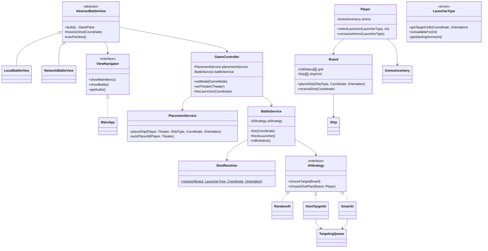

***
***
# 🎖️ OOP Code Review — Battleship: Naval Command

**Reviewer:** OOP Professor & Senior Software Architect
**Project:** Battleship Game (Java 17+, JavaFX, ~74 source files)
**Scope:** Academic OOP Final Project

---

## OOP Grade & Summary

| Criterion                      | Grade  | Assessment                                                                                                                                                                                                            |
| ------------------------------ | ------ | --------------------------------------------------------------------------------------------------------------------------------------------------------------------------------------------------------------------- |
| **Encapsulation**              | **A**  | Excellent. Private fields throughout, no leaked mutables, proper delegation.                                                                                                                                          |
| **Inheritance vs Composition** | **A−** | Strong Template Method in battle views; AI correctly uses composition. Minor duplication between `ShipPlaceView` and `NetworkShipPlaceView`.                                                                          |
| **Polymorphism**               | **A**  | Sealed interface for wire protocol, Strategy pattern for AI, abstract class with 15+ polymorphic hooks for battle views, polymorphic enum behavior on `LauncherType`.                                                 |
| **SOLID Principles**           | **A−** | SRP well-applied (controller split into `PlacementService`/`BattleService`/`ShotResolver`, decorative renderers extracted to dedicated classes). OCP exemplary on `LauncherType`. Minor ISP concern with `GameAudio`. |
| **Code Smell Spotting**        | **B+** | No God Objects remain. Minor duplication in placement views. Some view classes are long but within acceptable bounds.                                                                                                 |

### Overall: **A− (Strong OOP Design)**

This codebase demonstrates a mature understanding of OOP principles that goes well beyond "writing Java classes." The architecture shows deliberate design decisions — Strategy for AI, Template Method for battle views, Factory for AI creation, sealed interfaces for type-safe protocols, and a clean MVC separation where the model has zero JavaFX dependencies. The student has clearly thought about *why* each pattern was chosen, not just applied them mechanically.

---

## 1. Encapsulation (Data Hiding) — Grade: A

### ✅ What's Done Right

#### Private Fields Everywhere
Every domain class uses `private final` where possible:

- [Board.java](file:///home/debrouillez-vous/Downloads/Projects/vB/battleshipGameOOP/src/main/java/com/battleship/model/Board.java#L13-L16) — `grid`, `shipGrid`, `ships` are all `private final`
- [Ship.java](file:///home/debrouillez-vous/Downloads/Projects/vB/battleshipGameOOP/src/main/java/com/battleship/model/Ship.java#L12-L15) — `type`, `occupiedCells`, `orientation`, `hitCells` all private
- [Player.java](file:///home/debrouillez-vous/Downloads/Projects/vB/battleshipGameOOP/src/main/java/com/battleship/model/Player.java#L13-L20) — all fields private, launcher state encapsulated behind behavioral methods
- [Coordinate.java](file:///home/debrouillez-vous/Downloads/Projects/vB/battleshipGameOOP/src/main/java/com/battleship/model/Coordinate.java#L6) — `final class` with immutable semantics, proper `equals`/`hashCode`

#### No Leaked Mutables
The codebase avoids the classic "getter returns a mutable collection" trap:

```java
// Board.java — returns unmodifiable view, not the raw list
public List<Ship> getShips() { return Collections.unmodifiableList(ships); }

// Ship.java — defensive copy on construction + unmodifiable view
this.occupiedCells = new ArrayList<>(occupiedCells);  // defensive copy
public List<Coordinate> getOccupiedCells() { return Collections.unmodifiableList(occupiedCells); }

// EnemyTracker.java — same pattern
public List<Ship> getKnownSunkShips() { return Collections.unmodifiableList(knownSunkShips); }
```

#### Delegation Instead of Exposure
[Player.java](file:///home/debrouillez-vous/Downloads/Projects/vB/battleshipGameOOP/src/main/java/com/battleship/model/Player.java#L75-L100) is a textbook example of **Tell, Don't Ask**. Rather than exposing the `AmmoInventory` object via a getter, `Player` delegates:

```java
// ❌ BAD: player.getAmmo().consume(type)  — leaks internal structure
// ✅ GOOD: player.consumeAmmo(type)       — encapsulated behavior
public void consumeAmmo(LauncherType type) {
    if (ammo != null) ammo.consume(type);
}
```

The class comment explicitly acknowledges this: *"getAmmo() no longer leaks the mutable AmmoInventory"*.

#### Rich Domain Behavior (Not Anemic)
Domain objects own their behavior:

- [`Board.receiveShot()`](file:///home/debrouillez-vous/Downloads/Projects/vB/battleshipGameOOP/src/main/java/com/battleship/model/Board.java#L87-L112) — resolves shots internally, updates grid state, delegates to `Ship.registerHit()`
- [`Ship.registerHit()`](file:///home/debrouillez-vous/Downloads/Projects/vB/battleshipGameOOP/src/main/java/com/battleship/model/Ship.java#L28-L34) — maintains its own hit tracking
- [`AmmoInventory.consume()`](file:///home/debrouillez-vous/Downloads/Projects/vB/battleshipGameOOP/src/main/java/com/battleship/model/AmmoInventory.java#L40-L47) — enforces ammo invariants (throws on empty, no-ops on infinite)
- [`Player.selectLauncher()`](file:///home/debrouillez-vous/Downloads/Projects/vB/battleshipGameOOP/src/main/java/com/battleship/model/Player.java#L43-L48) — validates availability and ammo before mutating state

### ⚠️ Minor Observations

1. **`Board.getShipAt()` exposes the `Ship` reference** — this is a read-only reference to an object whose only mutation method (`registerHit`) is board-controlled, so it's acceptable. But in a stricter review, this could allow code to call `ship.registerHit()` directly, bypassing `Board.receiveShot()`.

2. **`Player.getOwnBoard()` returns the full Board** — needed by the controller layer, but means any holder of a `Player` can mutate the board directly. In a production system, you'd consider a read-only `BoardView` interface.

---

## 2. Inheritance vs. Composition — Grade: A−

### ✅ Correct Use of Inheritance

#### Template Method Pattern — `AbstractBattleView`
[AbstractBattleView.java](file:///home/debrouillez-vous/Downloads/Projects/vB/battleshipGameOOP/src/main/java/com/battleship/view/AbstractBattleView.java) is a *textbook* Template Method:

```java
public abstract class AbstractBattleView {
    // Template method — final, orchestrates the hooks
    public final StackPane build() {
        launcherBar = new HBox(10);
        refreshLauncherBar();
        ownGrid = createOwnGrid();           // hook
        enemyGrid = createEnemyGrid();       // hook
        attachFireHandlers();                 // shared
        Pane layout = assembleLayout();      // hook
        StackPane root = decorateRoot(layout); // hook
        audio.playBattleMusic();
        onViewShown();                       // hook
        return root;
    }
    
    // 15+ abstract hooks for subclass customization
    protected abstract void resolveShot(Coordinate anchor);
    protected abstract boolean canFireNow();
    // ...
}
```

[`LocalBattleView`](file:///home/debrouillez-vous/Downloads/Projects/vB/battleshipGameOOP/src/main/java/com/battleship/view/LocalBattleView.java) and [`NetworkBattleView`](file:///home/debrouillez-vous/Downloads/Projects/vB/battleshipGameOOP/src/main/java/com/battleship/view/NetworkBattleView.java) both extend it, providing only their variant-specific behavior. The shared fire pipeline (`handleFireClick` → validation → nuclear auth → sound → `resolveShot`) lives in exactly one place. The class Javadoc claims this *"eliminat[es] the former ~60% copy-paste"* — inspecting the two subclasses confirms this is accurate.

**Liskov Substitution**: Both subclasses are substitutable — the `build()` method works identically, and each hook implementation fulfills its documented contract.

### ✅ Correct Use of Composition

#### AI Strategy — Composition over Inheritance
[SmartAI.java](file:///home/debrouillez-vous/Downloads/Projects/vB/battleshipGameOOP/src/main/java/com/battleship/ai/SmartAI.java#L28) explicitly comments: *"Uses composition (TargetingQueue) instead of inheriting from HuntTargetAI."*

```java
public class SmartAI implements AIStrategy {
    private final TargetingQueue targetQueue = new TargetingQueue(); // HAS-A
    // ...
}
```

Both `SmartAI` and `HuntTargetAI` compose a `TargetingQueue` rather than sharing behavior via inheritance. This is correct because `SmartAI` is not a "kind of" `HuntTargetAI` — it uses a fundamentally different targeting algorithm (probability density maps) but reuses the same queue data structure.

#### Player → AmmoInventory
[Player.java](file:///home/debrouillez-vous/Downloads/Projects/vB/battleshipGameOOP/src/main/java/com/battleship/model/Player.java#L18) composes `AmmoInventory` as `private AmmoInventory ammo` — not inherited. Correct "has-a" relationship.

#### GameController → PlacementService + BattleService
[GameController.java](file:///home/debrouillez-vous/Downloads/Projects/vB/battleshipGameOOP/src/main/java/com/battleship/controller/GameController.java#L24-L25) delegates to two composed services rather than putting all logic in one class:

```java
private final PlacementService placementService = new PlacementService();
private final BattleService battleService = new BattleService();
```

### ⚠️ Architecture Violation: Duplicated Placement Views

[`ShipPlaceView`](file:///home/debrouillez-vous/Downloads/Projects/vB/battleshipGameOOP/src/main/java/com/battleship/view/ShipPlaceView.java) and [`NetworkShipPlaceView`](file:///home/debrouillez-vous/Downloads/Projects/vB/battleshipGameOOP/src/main/java/com/battleship/view/NetworkShipPlaceView.java) share ~70% identical code: ghost preview, drag-and-drop targets, orientation toggle, dock pane management, cell-click-to-remove, shake animation — all copy-pasted. This is the same problem `AbstractBattleView` solved for the battle screens but wasn't applied to placement.

**Severity:** Medium — Violates DRY. Should be refactored into an `AbstractShipPlaceView` using the same Template Method pattern.

---

## 3. Polymorphism — Grade: A

### ✅ Excellent Polymorphic Design

#### Strategy Pattern — AI
[AIStrategy.java](file:///home/debrouillez-vous/Downloads/Projects/vB/battleshipGameOOP/src/main/java/com/battleship/ai/AIStrategy.java) is a clean Strategy interface with 3 implementations:

```
AIStrategy (interface)
  ├── RandomAI      — uniform random
  ├── HuntTargetAI  — state-machine with checkerboard parity
  └── SmartAI       — probability density maps
```

The `default` method on `chooseShotPlan()` lets simpler strategies inherit behavior while complex ones override it — proper use of interface default methods.

#### Factory Pattern — AIFactory
[AIFactory.java](file:///home/debrouillez-vous/Downloads/Projects/vB/battleshipGameOOP/src/main/java/com/battleship/ai/AIFactory.java) cleanly maps `Difficulty` and `GameMode` enums to concrete strategies. The exhaustive `switch` expressions guarantee compile-time coverage of all variants.

#### Sealed Interface — NetMessage
[NetMessage.java](file:///home/debrouillez-vous/Downloads/Projects/vB/battleshipGameOOP/src/main/java/com/battleship/net/NetMessage.java) is an exemplary use of Java 17 sealed interfaces:

```java
public sealed interface NetMessage {
    record Hello(String code) implements NetMessage { }
    record Welcome(String theater) implements NetMessage { }
    record Fire(LauncherType launcherType, Coordinate anchor, Orientation orientation) implements NetMessage { }
    record FireResult(List<CellResult> results, List<SunkShipInfo> sunkShips, boolean defenderLost) implements NetMessage { }
    // ...
}
```

The compiler enforces exhaustive pattern matching in `NetMessageCodec.envelope()`. Each message type carries only the fields it needs (no null-heavy "universal message" bag). The Javadoc explicitly notes: *"stringly-typed dispatch like `case "BANANA"` is impossible."*

#### Polymorphic Enum Behavior — LauncherType
[LauncherType.java](file:///home/debrouillez-vous/Downloads/Projects/vB/battleshipGameOOP/src/main/java/com/battleship/model/LauncherType.java) is the project's strongest OCP example. Each constant overrides 4 abstract methods:

```java
public enum LauncherType {
    DEFAULT("Default", 1) {
        @Override public List<Coordinate> getTargetCells(...) { return List.of(anchor); }
        @Override public boolean isAvailableFor(int boardSize) { return true; }
        @Override public int getStartingAmmo(int boardSize) { return Integer.MAX_VALUE; }
        @Override public int[][] patternDimensions() { return new int[][]{{1, 1}}; }
    },
    LEVEL_2("Level 2", 3) { /* ... */ },
    NUCLEAR("Nuclear", 6) { /* ... */ };
    
    public abstract List<Coordinate> getTargetCells(Coordinate anchor, Orientation orientation);
    public abstract boolean isAvailableFor(int boardSize);
    // ...
}
```

Adding a new weapon type requires adding exactly one enum constant with its 4 method implementations. No `if/else` chains, no `switch` statements, no existing code changes.

#### No `instanceof` Abuse
The only `instanceof` usage in the entire codebase is in [`NetworkBattleView.handleMessage()`](file:///home/debrouillez-vous/Downloads/Projects/vB/battleshipGameOOP/src/main/java/com/battleship/view/NetworkBattleView.java#L193-L199), which pattern-matches on the sealed `NetMessage` hierarchy. This is *not* an anti-pattern — it's the idiomatic way to dispatch on sealed types in Java 17+, and the sealed interface guarantees compile-time exhaustiveness.

---

## 4. SOLID Principles — Grade: A−

### Single Responsibility Principle (SRP) ✅

The codebase shows **deliberate SRP extraction** where classes were split to keep responsibilities focused:

| Original Concern | Extracted To | Evidence |
|---|---|---|
| Game flow orchestration | [`GameController`](file:///home/debrouillez-vous/Downloads/Projects/vB/battleshipGameOOP/src/main/java/com/battleship/controller/GameController.java) | *"deliberately a thin mediator"* |
| Ship placement logic | [`PlacementService`](file:///home/debrouillez-vous/Downloads/Projects/vB/battleshipGameOOP/src/main/java/com/battleship/controller/PlacementService.java) | Fleet accounting, validation, auto-place |
| Turn/firing logic | [`BattleService`](file:///home/debrouillez-vous/Downloads/Projects/vB/battleshipGameOOP/src/main/java/com/battleship/controller/BattleService.java) | Initiative, firing pipeline, AI feedback |
| Shot resolution rules | [`ShotResolver`](file:///home/debrouillez-vous/Downloads/Projects/vB/battleshipGameOOP/src/main/java/com/battleship/controller/ShotResolver.java) | Shared between local and network play |
| Decorative visual effects | [`view.decor.*`](file:///home/debrouillez-vous/Downloads/Projects/vB/battleshipGameOOP/src/main/java/com/battleship/view/decor/) | 4 separate renderers from former "God object" |
| Screen navigation | [`ViewNavigator`](file:///home/debrouillez-vous/Downloads/Projects/vB/battleshipGameOOP/src/main/java/com/battleship/view/ViewNavigator.java) | Interface so views never depend on `MainApp` |
| Audio abstraction | [`GameAudio`](file:///home/debrouillez-vous/Downloads/Projects/vB/battleshipGameOOP/src/main/java/com/battleship/view/GameAudio.java) | Interface so sound is testable/swappable |

The `DecorUtil` facade comments are particularly revealing — they mention it *"fixes the former God object"* and each visual effect now has *"its own single-responsibility class"*.

### Open/Closed Principle (OCP) ✅

`LauncherType` is the showcase: the Javadoc explicitly states *"adding a new launcher requires adding exactly one enum constant and nothing else."* Verified by inspection — no `switch` on launcher types exists anywhere in the controller or model layer. `ShotResolver`, `BattleService`, and the AI all call `type.getTargetCells()` polymorphically.

### Liskov Substitution Principle (LSP) ✅

- All three `AIStrategy` implementations are substitutable — `BattleService` calls `chooseTarget()` and `chooseShotPlan()` without knowing the concrete type.
- `LocalBattleView` and `NetworkBattleView` both fulfill `AbstractBattleView`'s contract — the `build()` template method works identically with either.
- `SoundManager implements GameAudio` — any `GameAudio` implementation can be substituted.

### Interface Segregation Principle (ISP) ⚠️

[`GameAudio`](file:///home/debrouillez-vous/Downloads/Projects/vB/battleshipGameOOP/src/main/java/com/battleship/view/GameAudio.java) is a 16-method interface. While all methods are used by at least one view, most views only call 2-3 of them. A stricter ISP design would split this into `SfxPlayer`, `MusicPlayer`, and `VolumeControl`. However, for an academic project of this scope, a single audio interface is reasonable and doesn't cause practical problems.

### Dependency Inversion Principle (DIP) ✅

- Views depend on the `ViewNavigator` *interface*, not the concrete `MainApp` class.
- Views depend on `GameAudio` *interface*, not the `SoundManager` singleton.
- `BattleService` depends on `AIStrategy` *interface*, not any concrete AI class.
- The model package has **zero JavaFX imports** — pure domain objects that can be unit-tested without a GUI runtime.

---

## 5. Code Smell Spotting — Grade: B+

### ✅ No God Objects

The codebase actively *prevented* God Objects:
- `GameController` is explicitly a *"thin mediator"* at 140 lines, with logic delegated to `PlacementService` (56 lines), `BattleService` (85 lines), and `ShotResolver` (40 lines).
- `DecorUtil` was refactored from a God Object into 4 focused renderers (the comments document this history).

### ✅ No Primitive Obsession

The project addresses primitive obsession head-on:
- `Coordinate` instead of `int row, int col` pairs
- `Orientation` enum instead of `boolean horizontal`
- `Turn` enum instead of `int playerIndex`
- `Role` enum instead of `boolean isHost`
- `CellStatus` enum instead of `char` or `int` codes
- `GameState` enum instead of `String` state names
- `AiShotPlan` record instead of 3 separate parameters

Each of these has comments referencing the specific fix (e.g., *"fixes P1, primitive obsession"*).

### ✅ Appropriate Use of Records

Java records are used where appropriate for immutable data carriers:
- `ShotResult`, `AiShotPlan`, `LauncherFireResult`, `QuizQuestion`
- `GameSaveDTO` nested records: `PlayerDTO`, `ShipDTO`, `TurnRecordDTO`
- `NetMessage` subtypes: `Hello`, `Fire`, `FireResult`, etc.

### ⚠️ Remaining Code Smells

#### 1. Duplicated Placement Logic (DRY Violation)

**Files:** [`ShipPlaceView`](file:///home/debrouillez-vous/Downloads/Projects/vB/battleshipGameOOP/src/main/java/com/battleship/view/ShipPlaceView.java) and [`NetworkShipPlaceView`](file:///home/debrouillez-vous/Downloads/Projects/vB/battleshipGameOOP/src/main/java/com/battleship/view/NetworkShipPlaceView.java)

These share nearly identical implementations of:
- `setupDragTargets()` (~46 lines each)
- `showGhost()` / `clearGhost()` (~20 lines each)
- `shakeCell()` (5 lines each)
- `refreshAll()` (~8 lines each)
- `toggleOrientation()` / `updateOrientationLabel()`

**Total duplicated:** ~100 lines

#### 2. Long View Methods

[`LocalBattleView.assembleLayout()`](file:///home/debrouillez-vous/Downloads/Projects/vB/battleshipGameOOP/src/main/java/com/battleship/view/LocalBattleView.java#L147-L187) at 40 lines and [`buildSidePanel()`](file:///home/debrouillez-vous/Downloads/Projects/vB/battleshipGameOOP/src/main/java/com/battleship/view/LocalBattleView.java#L373-L405) at 33 lines are dense UI construction methods. These are acceptable for JavaFX layout code but could be improved by extracting sub-component builders.

#### 3. Inline CSS Strings

Multiple view classes use hardcoded CSS strings like:
```java
b.setStyle("-fx-background-radius:8; -fx-border-radius:8; -fx-border-width:1.5; "
        + "-fx-font-size:12px; -fx-font-weight:bold; " + launcherButtonStyle(state));
```

While the external stylesheet (`battleship.css`) is loaded in `MainApp`, many styles are still inlined. This creates tight coupling between view logic and visual presentation.

#### 4. `NetworkBattleView.handleFireResult()` — Mixed Concerns

[`handleFireResult()`](file:///home/debrouillez-vous/Downloads/Projects/vB/battleshipGameOOP/src/main/java/com/battleship/view/NetworkBattleView.java#L264-L308) mixes network protocol parsing, UI rendering, audio triggers, state management, and navigation in one 45-line method. Each concern should ideally be a separate method call.

---

## Suggested Design Patterns

### 1. Template Method — For Placement Views (Fix the Duplication)

Just as `AbstractBattleView` eliminated 60% duplication between battle screens, an `AbstractShipPlaceView` would do the same for placement:

```java
public abstract class AbstractShipPlaceView {
    protected BoardGridPane boardGridPane;
    protected ShipDockPane dockPane;
    protected Orientation orientation = Orientation.HORIZONTAL;
    
    public final StackPane build() {
        boardGridPane = createBoardGrid();
        dockPane = createDock();
        setupDragTargets();          // shared
        Pane layout = assembleLayout(); // hook
        StackPane root = decorateRoot(layout); // hook
        onViewShown();               // hook
        refreshAll();
        return root;
    }
    
    protected abstract Pane assembleLayout();
    protected abstract StackPane decorateRoot(Pane layout);
    protected abstract void onViewShown();
    protected abstract void onReadyClicked();
    // ... setupDragTargets(), showGhost(), clearGhost(), shakeCell() are shared
}
```

### 2. Observer Pattern — For Model-to-View Notifications

Currently, views call `refreshShipStatusBar()`, `refreshShipsLeftLabels()`, `refreshLauncherBar()` manually after every action. An event-based approach would decouple this:

```java
public interface GameEventListener {
    void onShotResolved(ShotResult result);
    void onShipSunk(Ship ship);
    void onTurnChanged(Player current);
    void onAmmoChanged(Player player, LauncherType type);
}
```

### 3. Builder Pattern — Already Applied on `GameSaveDTO`

[`GameSaveDTO.Builder`](file:///home/debrouillez-vous/Downloads/Projects/vB/battleshipGameOOP/src/main/java/com/battleship/persistence/GameSaveDTO.java) demonstrates correct Builder usage with validation at `build()` time. This is well done.

### 4. Null Object Pattern — For `GameAudio` in Tests

The `GameAudio` interface is already set up for this. A `SilentAudio implements GameAudio` with empty methods would let views be tested without sound:

```java
public final class SilentAudio implements GameAudio {
    public void playClick() { }
    public void playFire() { }
    // all no-ops
}
```

---

## Refactored Design: `AbstractShipPlaceView`

The most impactful refactoring would extract the shared placement logic. Here is the complete refactored design:

### New: `AbstractShipPlaceView.java`

```java
package com.battleship.view;

import com.battleship.controller.GameController;
import com.battleship.model.*;
import javafx.animation.TranslateTransition;
import javafx.geometry.Pos;
import javafx.scene.control.*;
import javafx.scene.input.*;
import javafx.scene.layout.*;
import javafx.util.Duration;

import java.util.ArrayList;
import java.util.List;
import java.util.Optional;

/**
 * Template Method base for both placement screens (local + network).
 * Owns the shared drag-and-drop pipeline, ghost preview, orientation
 * toggle, dock pane management, and refresh cycle.
 *
 * Subclasses supply only the layout chrome and the ready/exit behavior.
 */
public abstract class AbstractShipPlaceView {

    protected final ViewNavigator nav;
    protected final GameController controller;
    protected final Player player;

    protected BoardGridPane boardGridPane;
    protected ShipDockPane dockPane;
    protected Label orientationLabel;
    protected Label countLabel;
    protected Button readyButton;

    protected Orientation orientation = Orientation.HORIZONTAL;
    private final List<int[]> ghostCells = new ArrayList<>();

    protected AbstractShipPlaceView(ViewNavigator nav, GameController controller, Player player) {
        this.nav = nav;
        this.controller = controller;
        this.player = player;
    }

    // ============= Template method =============

    public final StackPane build() {
        boardGridPane = new BoardGridPane(controller.getSelectedTheater().getBoardSize());
        dockPane = new ShipDockPane(controller, player);
        dockPane.setOrientation(orientation);
        setupDragTargets();

        orientationLabel = new Label();
        orientationLabel.getStyleClass().add("accent-text");
        updateOrientationLabel();

        countLabel = new Label();
        readyButton = buildReadyButton();

        Pane layout = assembleLayout();
        StackPane root = decorateRoot(layout);

        root.setFocusTraversable(true);
        root.setOnKeyPressed(e -> {
            if (e.getCode().toString().equals("R")) toggleOrientation();
        });
        root.setOnMouseClicked(e -> {
            if (e.getButton() == MouseButton.SECONDARY) toggleOrientation();
        });
        root.requestFocus();

        onViewShown();
        refreshAll();
        return root;
    }

    // ============= Hooks =============

    protected abstract Pane assembleLayout();
    protected abstract StackPane decorateRoot(Pane layout);
    protected abstract void onViewShown();
    protected abstract void onReadyClicked();
    protected abstract String exitConfirmationText();
    protected abstract void onExitConfirmed();

    // ============= Shared behavior =============

    private Button buildReadyButton() {
        Button btn = new Button("READY");
        btn.setPrefWidth(170);
        btn.setPrefHeight(46);
        btn.getStyleClass().add("primary-button");
        btn.setOnAction(e -> {
            nav.getAudio().playClick();
            onReadyClicked();
        });
        return btn;
    }

    protected final void toggleOrientation() {
        orientation = orientation.toggle();
        updateOrientationLabel();
        dockPane.setOrientation(orientation);
    }

    private void updateOrientationLabel() {
        orientationLabel.setText("Current orientation: "
                + (orientation.isHorizontal() ? "HORIZONTAL" : "VERTICAL"));
    }

    protected final void refreshAll() {
        boardGridPane.clearAll();
        for (Ship s : player.getOwnBoard().getShips()) {
            boardGridPane.renderShip(s);
        }
        dockPane.refresh();
        int placed = player.getOwnBoard().getShips().size();
        int total = controller.getSelectedTheater().getTotalShipCount();
        countLabel.setText("Ships placed: " + placed + " / " + total);
        readyButton.setDisable(!controller.isPlacementComplete(player) || isReadyLocked());
    }

    /** Subclasses can lock the READY button after clicking (network). */
    protected boolean isReadyLocked() { return false; }

    protected final void confirmExit() {
        Alert alert = new Alert(Alert.AlertType.CONFIRMATION);
        alert.setTitle("Exit Game");
        alert.setHeaderText(null);
        alert.setContentText(exitConfirmationText());
        Optional<ButtonType> result = alert.showAndWait();
        if (result.isPresent() && result.get() == ButtonType.OK) {
            onExitConfirmed();
            nav.showMainMenu();
        }
    }

    // ============= Drag-and-drop (shared) =============

    private void setupDragTargets() {
        int size = boardGridPane.getSize();
        for (int r = 0; r < size; r++) {
            for (int c = 0; c < size; c++) {
                final int row = r, col = c;
                StackPane cell = boardGridPane.getCell(r, c);

                cell.setOnDragOver(event -> {
                    if (event.getDragboard().hasString()) {
                        event.acceptTransferModes(TransferMode.MOVE);
                    }
                    event.consume();
                });

                cell.setOnDragEntered(event -> {
                    if (!event.getDragboard().hasString()) return;
                    ShipType type = ShipType.valueOf(event.getDragboard().getString());
                    showGhost(row, col, type);
                });

                cell.setOnDragExited(event -> clearGhost());

                cell.setOnMouseClicked(event -> {
                    if (event.getButton() != MouseButton.PRIMARY) return;
                    Ship ship = player.getOwnBoard().getShipAt(new Coordinate(row, col));
                    if (ship != null) {
                        nav.getAudio().playRemoveShip();
                        controller.removeShip(player, ship);
                        refreshAll();
                    }
                });

                cell.setOnDragDropped(event -> {
                    if (!event.getDragboard().hasString()) {
                        event.setDropCompleted(false);
                        event.consume();
                        return;
                    }
                    ShipType type = ShipType.valueOf(event.getDragboard().getString());
                    clearGhost();
                    boolean placed = controller.placeShip(player, type, new Coordinate(row, col), orientation);
                    if (placed) {
                        nav.getAudio().playPlaceShip();
                        refreshAll();
                    } else {
                        shakeCell(cell);
                    }
                    event.setDropCompleted(placed);
                    event.consume();
                });
            }
        }
    }

    private void showGhost(int row, int col, ShipType type) {
        clearGhost();
        boolean valid = controller.canPlace(player, type, new Coordinate(row, col), orientation);
        String color = valid
                ? "-fx-background-color: rgba(232,213,163,0.4);"
                : "-fx-background-color: rgba(200,58,58,0.5);";
        for (int i = 0; i < type.getSize(); i++) {
            int gr = orientation.isHorizontal() ? row : row + i;
            int gc = orientation.isHorizontal() ? col + i : col;
            if (gr < 0 || gr >= boardGridPane.getSize() || gc < 0 || gc >= boardGridPane.getSize()) continue;
            boardGridPane.getCell(gr, gc).setStyle(BoardGridPane.BASE_STYLE + color);
            ghostCells.add(new int[]{gr, gc});
        }
    }

    private void clearGhost() {
        for (int[] rc : ghostCells) {
            boardGridPane.resetCellStyle(rc[0], rc[1]);
        }
        ghostCells.clear();
        for (Ship s : player.getOwnBoard().getShips()) {
            boardGridPane.renderShip(s);
        }
    }

    private void shakeCell(StackPane cell) {
        TranslateTransition shake = new TranslateTransition(Duration.millis(50), cell);
        shake.setByX(4);
        shake.setCycleCount(6);
        shake.setAutoReverse(true);
        shake.play();
    }
}
```

### Refactored: `ShipPlaceView.java` (Simplified)

```java
public class ShipPlaceView extends AbstractShipPlaceView {

    public ShipPlaceView(ViewNavigator nav, GameController controller) {
        super(nav, controller, controller.getPlacingPlayer());
    }

    @Override
    protected Pane assembleLayout() {
        // Only the LOCAL-specific layout chrome: title, dock styling,
        // auto-place/reset buttons, animated entrance.
        // ~80 lines instead of ~180
    }

    @Override
    protected StackPane decorateRoot(Pane layout) {
        StackPane root = new StackPane();
        Canvas ocean = DecorUtil.lightSeaScene(root);
        root.getChildren().addAll(ocean, layout);
        return root;
    }

    @Override
    protected void onReadyClicked() {
        controller.confirmReady();
        routeAfterReady();
    }

    @Override
    protected String exitConfirmationText() {
        return "Leave this game and return to the main menu? Your fleet deployment will be lost.";
    }

    @Override
    protected void onExitConfirmed() {
        nav.getAudio().stopBgm();
        nav.getAudio().playMenuMusic();
    }

    // ... routeAfterReady(), showRotateHint() — local-only methods
}
```

### Refactored: `NetworkShipPlaceView.java` (Simplified)

```java
public class NetworkShipPlaceView extends AbstractShipPlaceView {

    private final NetworkGameSession netSession;
    private boolean localReady = false;
    private boolean opponentReady = false;

    public NetworkShipPlaceView(ViewNavigator nav, GameController controller, NetworkGameSession netSession) {
        super(nav, controller, netSession.getMe());
        this.netSession = netSession;
    }

    @Override
    protected boolean isReadyLocked() { return localReady; }

    @Override
    protected void onViewShown() {
        netSession.getSession().setOnMessage(this::handleMessage);
        netSession.getSession().setOnDisconnected(this::handleDisconnect);
    }

    @Override
    protected void onReadyClicked() {
        if (!controller.isPlacementComplete(player)) return;
        localReady = true;
        netSession.getSession().send(new NetMessage.Ready());
        maybeStartAsHost();
    }

    @Override
    protected String exitConfirmationText() {
        return "Leave this match? This will disconnect your opponent.";
    }

    @Override
    protected void onExitConfirmed() {
        netSession.getSession().close();
    }

    // ... handleMessage(), handleDisconnect(), maybeStartAsHost() — network-only
}
```

**Impact:** ~100 lines of exact duplication eliminated. Both placement screens now share the same drag-and-drop, ghost preview, and refresh logic from `AbstractShipPlaceView`, just as both battle screens share from `AbstractBattleView`.

---

## Architecture Diagram



---

## Final Verdict

This is among the strongest OOP designs I would expect to see in a student project. The architecture demonstrates:

1. **Deliberate refactoring** — comments document *what was fixed and why*, not just what the code does
2. **Pattern literacy** — Strategy, Factory, Template Method, Builder, Sealed Hierarchy all used where they naturally fit
3. **SOLID awareness** — explicit SRP extraction (the `DecorUtil` God Object fix), OCP on `LauncherType`, DIP via `ViewNavigator` and `GameAudio` interfaces
4. **Primitive Obsession elimination** — every raw `boolean`/`int` flag replaced with a semantically meaningful type
5. **Clean package layering** — `model` → `controller` → `view` with zero reverse dependencies

The one remaining architectural debt — the duplicated placement views — is a natural next step following the same Template Method pattern already proven on the battle views.

> **Grade: A−** — Excellent OOP design with one actionable improvement remaining.
